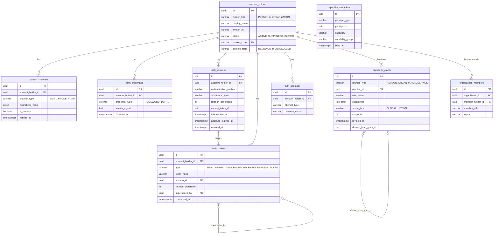

# Identity — overview

## Principal model

`account_holders` is the identity module's single principal root, since migration `037` retired
the legacy `users`/`user_roles`/`host_profiles` schema. Every JWT subject claim names an
`account_holders.id`; every other identity table points at that same id.



`capability_restrictions` is drawn without an FK arrow into `account_holders` because
`principal_id` is polymorphic (a person or an organization), the same reason `capability_grants`
resolves its grantee through `grantee_type` + `grantee_id` rather than a foreign key.

## Account holder lifecycle

```mermaid
stateDiagram-v2
    [*] --> ACTIVE: registration commits
    ACTIVE --> SUSPENDED: administrator action (planned; see 09-roadmap.md)
    SUSPENDED --> ACTIVE: administrator action (planned; see 09-roadmap.md)
    ACTIVE --> CLOSED: DELETE /api/v1/users/me
    SUSPENDED --> CLOSED: DELETE /api/v1/users/me
    CLOSED --> [*]
    note right of CLOSED
        Terminal. The row is retained --
        a closed holder still has to explain
        the bookings it contracted and the
        money it was paid.
    end note
```

Only the `ACTIVE -> CLOSED` transition has live code today (`UserAccountService.deleteOwnAccount`).
`SUSPENDED` is a real, enforced status — `AccountHolderFinder.requireActive` and `IdentityFacts`
both check for it — but nothing in this codebase currently sets an account to it; see
[`09-roadmap.md`](09-roadmap.md).

## Module map

| Package | Owns |
| --- | --- |
| `identity` (root) | `AccessTokenService`, `IdentityFacts` — the two types promoted for genuine external consumers (`JwtAuthenticationFilter`), plus the two published events |
| `identity.internal.model.account` | `AccountHolder`, `ContactChannel`, `OrganizationMember` and their enums |
| `identity.internal.model.credential` | `AuthCredential` and its enum |
| `identity.internal.model.session` | `AuthSession`, `AuthToken` and their enums |
| `identity.internal.model.capability` | `CapabilityGrant`, `CapabilityRestriction` and their enums |
| `identity.internal.repository.*` | One Spring Data JDBC repository per aggregate, mirroring the model packages |
| `identity.internal.service.auth` | `AuthenticationService` (register/login/refresh/logout), `AuthTokenFactory`, `UserRegistrationFactory` |
| `identity.internal.service.auth.session` | `RefreshTokenService`, `AuthSessionFactory` |
| `identity.internal.service.auth.verification` | `EmailVerificationService` |
| `identity.internal.service.auth.passwordreset` | `PasswordResetService`, `PasswordCredentialRotator` |
| `identity.internal.service.account` | `UserAccountService`, `AccountHolderFinder` |
| `identity.internal.service.authz` | `Capability`, `RoleBundle`, `AuthorizationService`, `CapabilityGrantService` |
| `identity.internal.service.host` | `HostOnboardingService` |
| `identity.internal.service.validation` | `PasswordPolicy` |
| `identity.internal.web` | `AuthController`, `UserController`, and every request/response record |

## Configuration

| Property | Default | Read by |
| --- | --- | --- |
| `security.jwt.secret` | *(required, no default)* | `AccessTokenService` |
| `security.jwt.access-token-expiration` | `15m` | `AccessTokenService` |
| `security.jwt.refresh-token-expiration` | `30d` | `RefreshTokenService` (also the session idle expiry) |
| `security.jwt.session-absolute-expiration` | `180d` | `RefreshTokenService` |
| `app.email-verification.url` | `http://localhost:3000/verify-email` | `AuthEmailNotifier` |
| `app.email-verification.token-ttl` | `24h` | `EmailVerificationService` |
| `app.email-verification.request-cooldown` | `60s` | `EmailVerificationService` |
| `app.email-verification.rate-limit-window` | `1h` | `EmailVerificationService` |
| `app.email-verification.rate-limit-max-requests` | `5` | `EmailVerificationService` |
| `app.password-reset.url` | `http://localhost:3000/reset-password` | `AuthEmailNotifier` |
| `app.password-reset.token-ttl` | `30m` | `PasswordResetService` |

## Status

Implemented, for the shape described above. `organization_members` and `capability_restrictions`
exist and are read by `AuthorizationService`/join queries but nothing yet writes a row into either
one — see [`09-roadmap.md`](09-roadmap.md).
