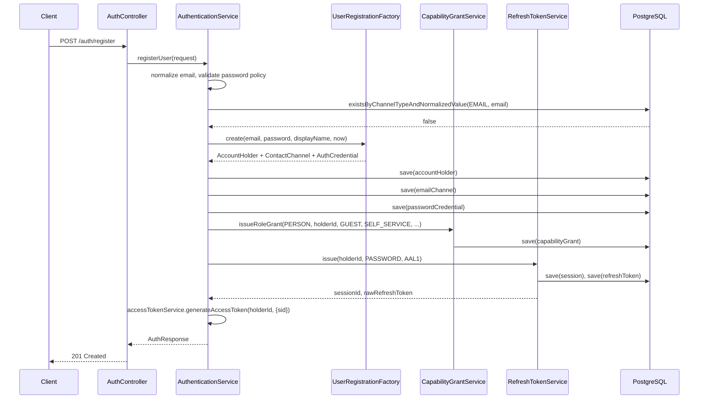

# Registration

## Purpose

Creates a new guest account and immediately authenticates it, so a new user never has to log in
separately right after signing up. Called by the public sign-up form.

## Endpoint

| | |
| --- | --- |
| Method / path | `POST /api/v1/auth/register` |
| Access | Public |
| Required capability | None |
| Assurance | N/A (no session exists yet) |

## Request

```json
{
  "email": "guest@example.com",
  "password": "Correct-Horse1!",
  "displayName": "Jamie Rivera"
}
```

| Field | Type | Required | Validation | Normalization |
| --- | --- | --- | --- | --- |
| `email` | string | yes | nonblank, valid address, ≤ 320 chars (`RegisterRequest`) | lowercased before lookup/storage (`StringUtils.normalizeLowerCase`) |
| `password` | string | yes | nonblank, ≥ 8 chars at the HTTP boundary; full strength policy (upper/lower/digit/special, ≤ 72 UTF-8 bytes) enforced by `PasswordPolicy` in the service | none — never normalized, only encoded |
| `displayName` | string | yes | nonblank, ≤ 120 chars | trimmed (`StringUtils.normalizeRequired`) |

## Response

`201 Created`

```json
{
  "accessToken": "eyJhbGciOiJIUzI1NiJ9...",
  "refreshToken": "8f3b1c2a9e...",
  "user": {
    "id": "0d6e7c2a-...",
    "email": "guest@example.com",
    "phoneNumber": null,
    "displayName": "Jamie Rivera",
    "avatarUrl": null,
    "status": "ACTIVE",
    "emailVerifiedAt": null,
    "roleNames": ["GUEST"],
    "capabilities": ["BOOKING_CANCEL_OWN", "BOOKING_CREATE", "MESSAGE_SEND", "REVIEW_WRITE_OWN"]
  }
}
```

| Field | Type | Notes |
| --- | --- | --- |
| `accessToken` | string | Signed JWT; `sub` is the new account holder id, `sid` is the new session id |
| `refreshToken` | string | Raw opaque secret; returned once, stored only as a SHA-256 digest |
| `user` | `UserResponse` | See field table in [`05-account-profile.md`](05-account-profile.md) |

## Flow



No post-commit event is published by registration itself; the client must call
[email-verification request](03-email-verification.md) to trigger `EmailVerificationIssued`.

## Rules and invariants

- **The existence check is best-effort, not the final defense.** Unlike the retired
  `users.email` unique column, `contact_channels` carries no database-level uniqueness for an
  unverified claim — two accounts may each claim the same address before either proves it, by
  design (see `ContactChannel`'s class Javadoc). A concurrent duplicate registration can therefore
  both succeed today; only a *verified* primary channel is unique
  (`uk_contact_channels_verified_primary_value`).
- **The account holder's own `createdAt` is the grant instant**, not a fresh clock read, so every
  row this workflow writes — the holder, the channel, the credential, and the capability grant —
  shares one decision instant.
- **The account holder is created with `context_state = UNRESOLVED`.** No market-resolution signal
  exists at registration time, and a guest does not need to transact immediately; guessing a market
  would let a contract form under rules nobody approved. `AccountHolder.canTransact()` is false for
  every account until an operator resolves this (no such workflow exists yet — see
  [`09-roadmap.md`](09-roadmap.md)).
- **The `GUEST` capability grant is `GLOBAL`-scoped and `SELF_SERVICE`-sourced.** It confers
  `BOOKING_CREATE`, `BOOKING_CANCEL_OWN`, `REVIEW_WRITE_OWN`, `MESSAGE_SEND` (`RoleBundle.GUEST`).
- **Only a password digest is ever stored.** `AuthCredential.verifierDigest` holds the BCrypt hash;
  the raw password is never persisted or logged.

## Persistence effects

All in one transaction (`@Transactional` on `AuthenticationService.registerUser`):

| Table | Effect |
| --- | --- |
| `account_holders` | One new row, `PERSON`, `ACTIVE`, `context_state = UNRESOLVED` |
| `contact_channels` | One new row, `EMAIL`, `is_primary = true`, unverified |
| `auth_credentials` | One new row, `PASSWORD`, active |
| `capability_grants` | One new row, `role_name = GUEST`, `GLOBAL` scope |
| `auth_sessions` | One new row, generation 0 |
| `auth_tokens` | One new row, `REFRESH_TOKEN`, generation 0, linked to the session |

## Errors

| Condition | HTTP | Code | What the client should do |
| --- | --- | --- | --- |
| `email`/`password`/`displayName` fails Bean Validation, or password fails `PasswordPolicy` | 400 | `VALIDATION_ERROR` | Fix the named field and resubmit |
| The normalized email already claims a channel | 409 | `EMAIL_ALREADY_REGISTERED` | Prompt the user to log in or reset their password instead |

## Events

None published by this endpoint itself.

## Status

Implemented, with the documented best-effort (not database-enforced) duplicate-email guard.
