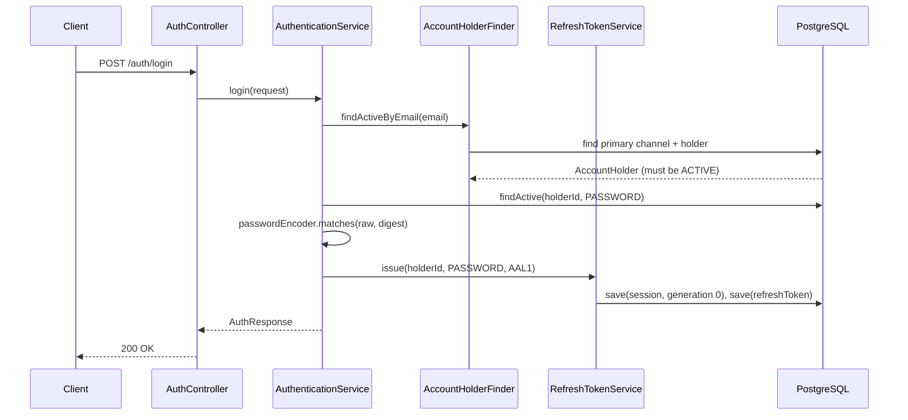
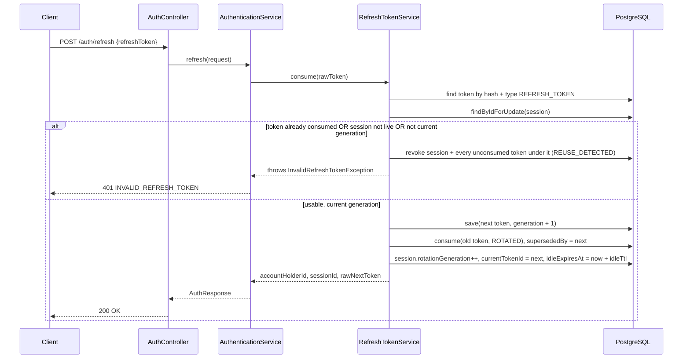
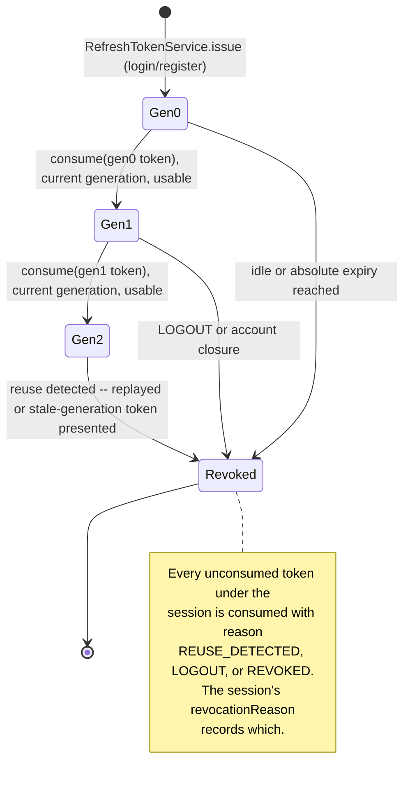
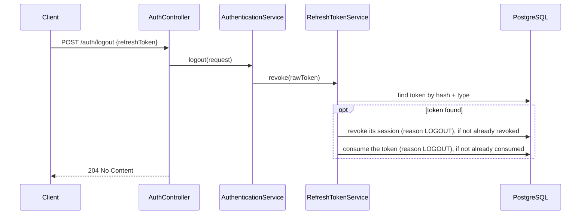

# Login, refresh, and logout

## Purpose

Authenticates an existing account, keeps it authenticated across access-token expiries via refresh
rotation, and lets a client end its session explicitly. Called by the client's login form, its
token-refresh interceptor, and its logout action.

---

## Login

### Endpoint

| | |
| --- | --- |
| Method / path | `POST /api/v1/auth/login` |
| Access | Public |
| Required capability | None |
| Assurance | Establishes `AAL1` |

### Request

```json
{ "email": "guest@example.com", "password": "Correct-Horse1!" }
```

| Field | Type | Required | Validation | Normalization |
| --- | --- | --- | --- | --- |
| `email` | string | yes | nonblank, valid address, ≤ 320 chars | lowercased before lookup |
| `password` | string | yes | nonblank | none — compared, never normalized |

### Response

`200 OK`, same `AuthResponse` shape as [registration](01-registration.md#response).

### Flow



### Rules and invariants

- **The same generic `InvalidCredentialsException` covers an unknown email and a wrong password**,
  so the response cannot be used to enumerate registered addresses.
- **`findActiveByEmail` resolves through the oldest matching primary email channel** when more than
  one unverified claim exists for the address (see [registration](01-registration.md)'s duplicate
  guard); the account must also be `ACTIVE` or the request fails with `USER_ACCOUNT_DISABLED`.
- Every login opens a **new** session at generation 0; login does not reuse an existing session.

### Persistence effects

`auth_sessions` (one new row) and `auth_tokens` (one new `REFRESH_TOKEN` row), in one transaction.
Nothing is written to `account_holders`, `contact_channels`, or `auth_credentials`.

### Errors

| Condition | HTTP | Code |
| --- | --- | --- |
| Bean Validation failure | 400 | `VALIDATION_ERROR` |
| Unknown email, or password does not match | 401 | `INVALID_CREDENTIALS` |
| Account is not `ACTIVE` | 403 | `USER_ACCOUNT_DISABLED` |

### Events

None.

### Status

Implemented.

---

## Refresh

### Endpoint

| | |
| --- | --- |
| Method / path | `POST /api/v1/auth/refresh` |
| Access | Public (bearer refresh token in the body, not the header) |
| Required capability | None |
| Assurance | Carries forward the session's existing assurance level |

### Request

```json
{ "refreshToken": "8f3b1c2a9e..." }
```

| Field | Type | Required | Validation |
| --- | --- | --- | --- |
| `refreshToken` | string | yes | nonblank |

### Response

`200 OK`, same `AuthResponse` shape. `refreshToken` in the response is the **next** generation's
secret; the presented one is now consumed and cannot be reused.

### Flow



### Session and rotation-lineage lifecycle



### Rules and invariants

- **A replayed or stale-generation token is reuse, not an ordinary refresh.** `session.isLiveAt`,
  `token.getConsumedAt()`, and `session.getCurrentTokenId()` together decide this; either failure
  revokes the *entire* session lineage (every unconsumed token under it), not just the presented
  token, because a stolen secret replayed after the legitimate client already rotated means the
  session itself is compromised.
- **Idle expiry slides forward on every successful rotation** (`idleExpiresAt = now +
  idleExpiration`). This is a fix over the original design, where idle expiry was set once at issue
  time and never moved, making it behave like a second absolute expiry — an actively used session
  died after one `security.jwt.refresh-token-expiration` window regardless of activity.
- **Every refresh token requires a session** (`ck_auth_tokens_refresh_requires_session`, migration
  `037`). There is no session-less fallback path; `RefreshTokenService` has no branch for it.

### Persistence effects

One transaction: either (a) a new `auth_tokens` row, the old one marked consumed with
`ROTATED`/`supersededBy`, and the session's generation/current-token/idle-expiry updated, or (b) the
session and every unconsumed token under it marked revoked/consumed with `REUSE_DETECTED`.

### Errors

| Condition | HTTP | Code |
| --- | --- | --- |
| Bean Validation failure | 400 | `VALIDATION_ERROR` |
| Token unknown, expired, already consumed, stale generation, or session not live | 401 | `INVALID_REFRESH_TOKEN` |

### Events

None.

### Status

Implemented.

---

## Logout

### Endpoint

| | |
| --- | --- |
| Method / path | `POST /api/v1/auth/logout` |
| Access | Public (bearer refresh token in the body) |
| Required capability | None |

### Request

```json
{ "refreshToken": "8f3b1c2a9e..." }
```

### Response

`204 No Content`.

### Flow



### Rules and invariants

- **Idempotent by design.** An absent, already-consumed, or already-revoked token is treated as
  "nothing to do" rather than an error, so retrying logout is always safe.
- Revokes the **session**, not only the presented token — this is what makes the revocation durable
  against a client that still holds an older generation's secret.

### Persistence effects

At most one `auth_sessions` update and one `auth_tokens` update.

### Errors

| Condition | HTTP | Code |
| --- | --- | --- |
| Bean Validation failure | 400 | `VALIDATION_ERROR` |

### Events

None.

### Status

Implemented.
