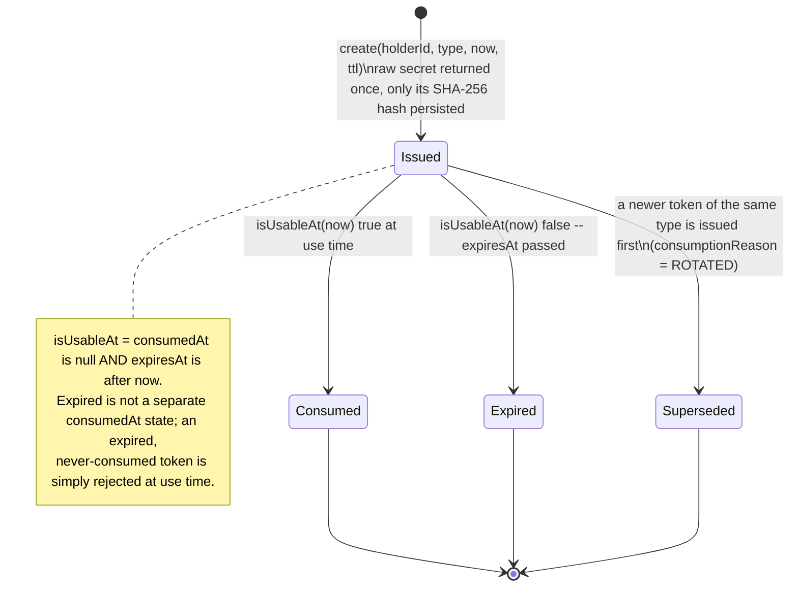
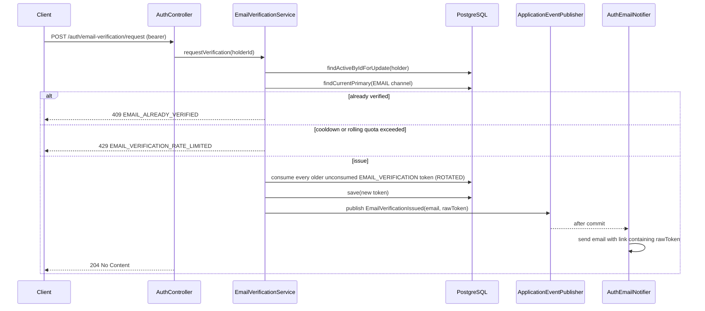
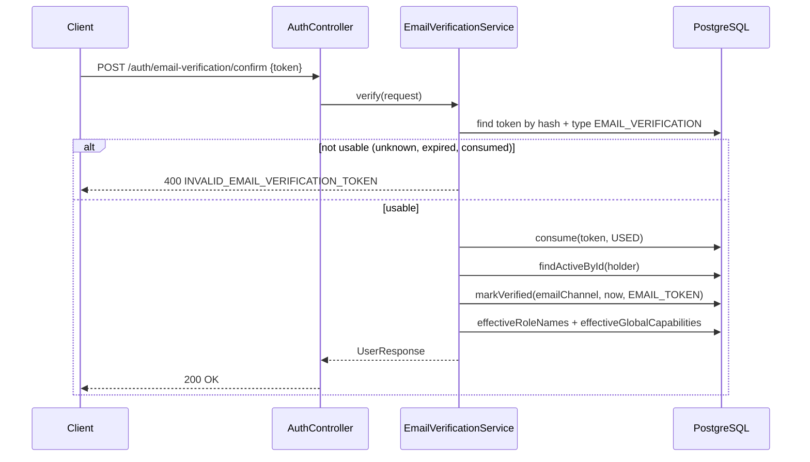

# Email verification

## Purpose

Proves control of the primary email channel. Called by the client after registration (to request a
link) and by the link itself (to confirm it).

## Opaque token lifecycle (shared by all three token types)

`EMAIL_VERIFICATION`, `PASSWORD_RESET`, and `REFRESH_TOKEN` rows all share `auth_tokens` and this
same lifecycle; only the issuing/consuming service and the semantics of "using" the token differ.



---

## Request a verification email

### Endpoint

| | |
| --- | --- |
| Method / path | `POST /api/v1/auth/email-verification/request` |
| Access | Bearer token |
| Required capability | None beyond being authenticated and active |
| Assurance | N/A |

### Request

No body.

### Response

`204 No Content`.

### Flow



### Rules and invariants

- **The holder row is locked (`findActiveByIdForUpdate`) before inspecting token history**, so two
  concurrent requests for the same account cannot each independently pass the cooldown/quota check.
- **Cooldown, then rolling quota.** A request inside the configured cooldown
  (`app.email-verification.request-cooldown`, default `60s`) since the last token is rejected first;
  only then is the rolling-window quota (`rate-limit-window` default `1h`, `rate-limit-max-requests`
  default `5`) checked. Both compute a `retryAt` the client can show.
- **A newly issued token supersedes every older unconsumed one** for the same holder and type.

### Persistence effects

Older unconsumed `EMAIL_VERIFICATION` tokens marked `ROTATED`; one new `auth_tokens` row.

### Errors

| Condition | HTTP | Code |
| --- | --- | --- |
| Missing/invalid bearer token | 401 | (generic unauthorized, no domain code) |
| Account not active | 403 | `USER_ACCOUNT_DISABLED` |
| Email already verified | 409 | `EMAIL_ALREADY_VERIFIED` |
| Cooldown or quota exceeded | 429 | `EMAIL_VERIFICATION_RATE_LIMITED` (`Retry-After` header, `data.retryAfterSeconds`) |

### Events

`EmailVerificationIssued(recipient, rawToken)` — delivered via a bare
`@TransactionalEventListener(phase = AFTER_COMMIT)` in `AuthEmailNotifier`, deliberately **not**
through Spring Modulith's `@ApplicationModuleListener` registry, because that registry persists the
full serialized event — including the raw token secret — as plaintext in `event_publication`. See
[`../../modules/identity.md`](../../modules/identity.md) § *Why `EmailVerificationIssued` and
`PasswordResetIssued` stay off the event registry*.

### Status

Implemented.

---

## Confirm a verification token

### Endpoint

| | |
| --- | --- |
| Method / path | `POST /api/v1/auth/email-verification/confirm` |
| Access | Public |
| Required capability | None (possession of the token is the proof) |

### Request

```json
{ "token": "PASTE_EMAIL_TOKEN_HERE" }
```

| Field | Type | Required | Validation |
| --- | --- | --- | --- |
| `token` | string | yes | nonblank |

### Response

`200 OK` — `UserResponse` (see [`05-account-profile.md`](05-account-profile.md)), with
`emailVerifiedAt` now set.

### Flow



### Rules and invariants

- **The token is consumed before its holder id is used**, making it one-time within the transaction
  even if two requests race on the same raw token.
- **Idempotent on an already-verified channel**: if `emailChannel.isVerified()` is already true, the
  method skips the write and still returns the current projection rather than failing.

### Persistence effects

`auth_tokens` (consumed), `contact_channels` (verified, if not already).

### Errors

| Condition | HTTP | Code |
| --- | --- | --- |
| Bean Validation failure | 400 | `VALIDATION_ERROR` |
| Token unknown, expired, or already consumed | 400 | `INVALID_EMAIL_VERIFICATION_TOKEN` |

### Events

None.

### Status

Implemented.
