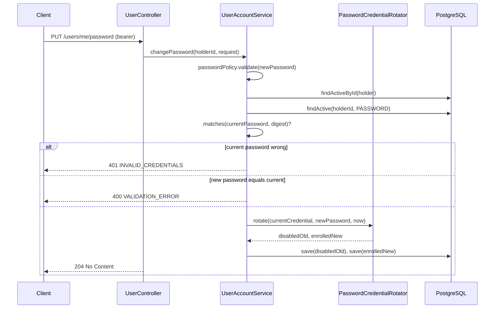
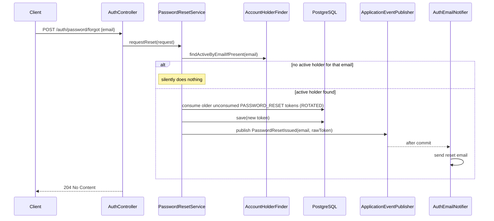
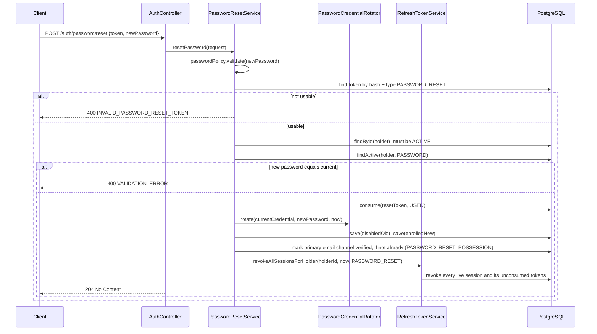

# Password management

## Purpose

Lets an authenticated user change a known password, and lets anyone recover a forgotten one without
the endpoint revealing which emails are registered.

---

## Change password

### Endpoint

| | |
| --- | --- |
| Method / path | `PUT /api/v1/users/me/password` |
| Access | Bearer token |
| Required capability | None beyond being authenticated and active |

### Request

```json
{ "currentPassword": "Correct-Horse1!", "newPassword": "New-Correct-Horse2!" }
```

| Field | Type | Required | Validation |
| --- | --- | --- | --- |
| `currentPassword` | string | yes | nonblank |
| `newPassword` | string | yes | nonblank, ≥ 8 chars at the boundary; full `PasswordPolicy` strength check in the service |

### Response

`204 No Content`.

### Flow



### Rules and invariants

- **A credential is replaced, not edited in place** — the old row is disabled
  (`disabledAt` set), the new one enrolled — so an investigation can still see that a factor was
  once present and when it stopped being usable.
- **The replacement must differ from the current password**, checked by comparing the new raw value
  against the *old* digest before rotating.
- Unlike password reset, **changing a known password does not revoke existing sessions** — the
  caller already proved possession of the current password, so there is no compromise to contain.

### Persistence effects

Two `auth_credentials` rows: one disabled, one newly enrolled.

### Errors

| Condition | HTTP | Code |
| --- | --- | --- |
| `newPassword` fails Bean Validation or `PasswordPolicy` | 400 | `VALIDATION_ERROR` |
| `currentPassword` does not match | 401 | `INVALID_CREDENTIALS` |
| Account not active | 403 | `USER_ACCOUNT_DISABLED` |

### Events

None.

### Status

Implemented.

---

## Request a password reset

### Endpoint

| | |
| --- | --- |
| Method / path | `POST /api/v1/auth/password/forgot` |
| Access | Public |
| Required capability | None |

### Request

```json
{ "email": "guest@example.com" }
```

### Response

`204 No Content` — **always**, for any syntactically valid email, whether or not it is registered.

### Flow



### Rules and invariants

- **Enumeration resistance is the point of this endpoint.** The response is identical whether the
  address belongs to an account or not; only a background email delivery (or its absence) differs,
  and that happens out of band from the HTTP response.

### Persistence effects

Conditional on an active match: older `PASSWORD_RESET` tokens marked `ROTATED`; one new token row.

### Errors

| Condition | HTTP | Code |
| --- | --- | --- |
| Bean Validation failure (malformed email) | 400 | `VALIDATION_ERROR` |

### Events

`PasswordResetIssued(recipient, rawToken)` — same off-registry delivery mechanism as
`EmailVerificationIssued`; see [`03-email-verification.md`](03-email-verification.md).

### Status

Implemented.

---

## Reset a password

### Endpoint

| | |
| --- | --- |
| Method / path | `POST /api/v1/auth/password/reset` |
| Access | Public (bearer reset token in the body) |
| Required capability | None (possession of the token is the proof) |

### Request

```json
{ "token": "PASTE_PASSWORD_RESET_TOKEN_HERE", "newPassword": "Recovered-Password3!" }
```

### Response

`204 No Content`.

### Flow



### Rules and invariants

- **Possessing the reset link proves control of the email address**, the same way an explicit
  verification token does — so a reset also verifies an unverified primary email channel as a side
  effect (`verificationMethod = PASSWORD_RESET_POSSESSION`).
- **Every live session is revoked**, not just outstanding tokens — a credential recovery is treated
  as a signal the previous credential may have been compromised, so nothing that was authenticated
  under it should remain trusted. Existing short-lived access JWTs still expire naturally rather
  than being blocklisted, but the very next request through `IdentityFacts` would find the *session*
  revoked if the endpoint also checked it, and the *account* still active — a client should
  therefore also re-fetch its session as part of the reset flow.
- Reuses `PasswordCredentialRotator` — the same disable-old/enroll-new construction as
  [change password](#change-password).

### Persistence effects

`auth_tokens` (reset token consumed), `auth_credentials` (rotated), `contact_channels` (verified,
conditionally), `auth_sessions` + `auth_tokens` (every live session and its tokens revoked).

### Errors

| Condition | HTTP | Code |
| --- | --- | --- |
| `newPassword` fails Bean Validation, `PasswordPolicy`, or repeats the current password | 400 | `VALIDATION_ERROR` |
| Token unknown, expired, already consumed, or its holder not active | 400 | `INVALID_PASSWORD_RESET_TOKEN` |

### Events

None.

### Status

Implemented.
