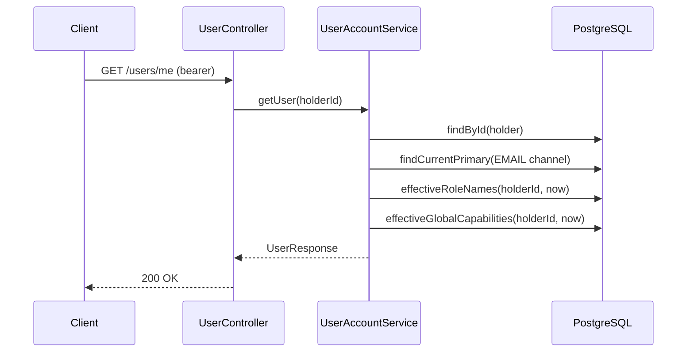
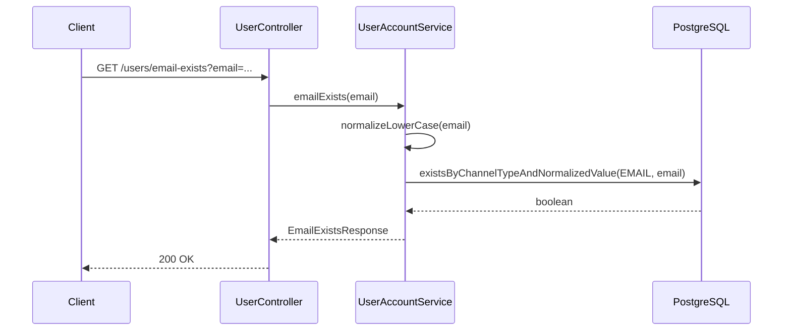
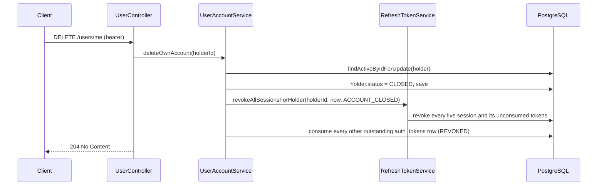

# Account profile

## Purpose

Lets a client read the current account's projection, check email availability before registering,
and let the account holder close their own account.

## `UserResponse` field table

Every endpoint on this page (and registration, login, refresh, and email-verification confirm)
returns this shape:

| Field | Type | Notes |
| --- | --- | --- |
| `id` | UUID | The account holder id; also the JWT `sub` |
| `email` | string, nullable | Normalized value of the current primary `EMAIL` channel, or `null` if none exists yet |
| `phoneNumber` | string, nullable | Normalized value of the current primary `PHONE` channel; always `null` today — phone channels are never created by any live workflow |
| `displayName` | string | From `account_holders.display_name` |
| `avatarUrl` | string, nullable | From `account_holders.avatar_url` |
| `status` | `ACTIVE` \| `SUSPENDED` \| `CLOSED` | `account_holders.status` |
| `emailVerifiedAt` | instant, nullable | `verified_at` of the primary email channel |
| `roleNames` | string[] | Distinct `role_name` values of currently effective `GLOBAL`-scoped grants |
| `capabilities` | string[] | Every capability name currently in force globally, sorted |

---

## Get the current user

### Endpoint

| | |
| --- | --- |
| Method / path | `GET /api/v1/users/me` |
| Access | Bearer token |
| Required capability | None beyond being authenticated |

### Response

`200 OK` — `UserResponse`, see table above.

### Flow



### Rules and invariants

- Read-only (`@Transactional(readOnly = true)`); this endpoint does not exist to have a business
  rule to enforce beyond "the account exists" — it is a projection.
- Unlike other identity endpoints, this one uses `findById` (not `findActiveById`): a suspended or
  closed account can still read its own projection, even though it cannot use most other endpoints.

### Errors

| Condition | HTTP | Code |
| --- | --- | --- |
| Missing/invalid bearer token | 401 | (generic unauthorized) |
| Holder no longer exists | 404 | `USER_NOT_FOUND` |

### Events

None.

### Status

Implemented.

---

## Check email availability

### Endpoint

| | |
| --- | --- |
| Method / path | `GET /api/v1/users/email-exists?email=...` |
| Access | Public |
| Required capability | None |

### Response

`200 OK`

```json
{ "exists": true }
```

### Flow



### Rules and invariants

- **This is a claimed-address check, not a verified-owner check.** It returns `true` the moment any
  account — verified or not — has claimed the address; it does not confirm the address is
  deliverable or that its claimant controls it.
- No authentication is required, and the response reveals only a boolean.

### Errors

| Condition | HTTP | Code |
| --- | --- | --- |
| Missing/malformed `email` query parameter | 400 | `VALIDATION_ERROR` |

### Events

None.

### Status

Implemented.

---

## Close the current account

### Endpoint

| | |
| --- | --- |
| Method / path | `DELETE /api/v1/users/me` |
| Access | Bearer token |
| Required capability | None beyond being authenticated and active |

### Response

`204 No Content`.

### Flow



### Rules and invariants

- **Terminal.** `CLOSED` is the end of the lifecycle in [`00-overview.md`](00-overview.md); nothing
  reopens a closed account.
- **The row is retained.** A closed holder still has to explain the bookings it contracted and the
  money it was paid, so this is a status change, never a row deletion.
- **The very next request with the still-unexpired access token used to close the account is
  rejected.** This is the regression `IdentityFacts`'s per-request database reload exists to
  prevent: without it, a stateless JWT would keep authenticating for up to
  `security.jwt.access-token-expiration` after closure.

### Persistence effects

`account_holders` (status), `auth_sessions` + `auth_tokens` (every live session and its tokens
revoked), remaining `auth_tokens` rows for the holder consumed with reason `REVOKED`.

### Errors

| Condition | HTTP | Code |
| --- | --- | --- |
| Account not active (already suspended or closed) | 403 | `USER_ACCOUNT_DISABLED` |

### Events

None.

### Status

Implemented.
