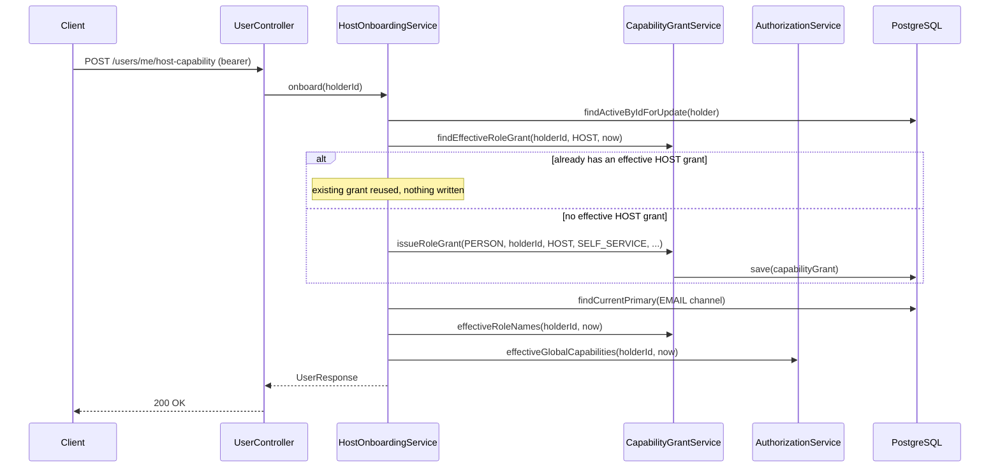

# Host onboarding

## Purpose

Grants an active account the ability to act as a host. Called by the client's "become a host" flow.

## Endpoint

| | |
| --- | --- |
| Method / path | `POST /api/v1/users/me/host-capability` |
| Access | Bearer token |
| Required capability | None beyond being authenticated and active — this is how a guest *acquires* the `HOST` capability, so it cannot itself require it |
| Assurance | N/A |

## Request

No body. (The retired `POST /api/v1/users/me/host-profile` endpoint used to accept an optional
`bio`; that field is dropped — see *Rules and invariants*.)

## Response

`200 OK` — `UserResponse` (see [`05-account-profile.md`](05-account-profile.md)), with `HOST` now
present in `roleNames` and the `HOST` bundle's capabilities present in `capabilities`.

```json
{
  "id": "0d6e7c2a-...",
  "email": "guest@example.com",
  "phoneNumber": null,
  "displayName": "Jamie Rivera",
  "avatarUrl": null,
  "status": "ACTIVE",
  "emailVerifiedAt": "2026-01-01T12:00:00Z",
  "roleNames": ["GUEST", "HOST"],
  "capabilities": [
    "BOOKING_CANCEL_OWN", "BOOKING_CREATE", "CALENDAR_MANAGE_OWN", "CAN_ACCEPT_BOOKING",
    "CAN_DRAFT", "CAN_PUBLISH", "CAN_RECEIVE_PAYOUT", "LISTING_MANAGE_OWN", "MESSAGE_SEND",
    "REVIEW_WRITE_OWN"
  ]
}
```

## Flow



## Rules and invariants

- **Idempotent.** Repeating the request finds the existing effective `HOST` grant through
  `CapabilityGrantService.findEffectiveRoleGrant` and returns the current projection instead of
  issuing a duplicate grant.
- **The holder row is locked** (`findActiveByIdForUpdate`) for the duration of the check-then-issue,
  so two concurrent onboarding requests cannot both observe "no grant yet" and both insert one.
- **`bio` is dropped from the API.** The retired `host_profiles` table's `bio`, `average_rating`,
  and `review_count` were never this module's facts to own (see
  [`../../features/identity-accounts-and-access.md`](../../features/identity-accounts-and-access.md)
  § *Profile facts and their consumers*). This endpoint now does exactly one thing: issue a
  capability grant. Whichever module eventually owns the public host profile starts from nothing
  rather than inheriting this table.
- The grant is `GLOBAL`-scoped and `SELF_SERVICE`-sourced, identical in shape to the `GUEST` grant
  registration issues.

## Persistence effects

At most one new `capability_grants` row (`role_name = HOST`, `GLOBAL` scope). No write at all on a
repeated request.

## Errors

| Condition | HTTP | Code |
| --- | --- | --- |
| Account not active | 403 | `USER_ACCOUNT_DISABLED` |
| Holder no longer exists | 404 | `USER_NOT_FOUND` |

## Events

None.

## Status

Implemented.
