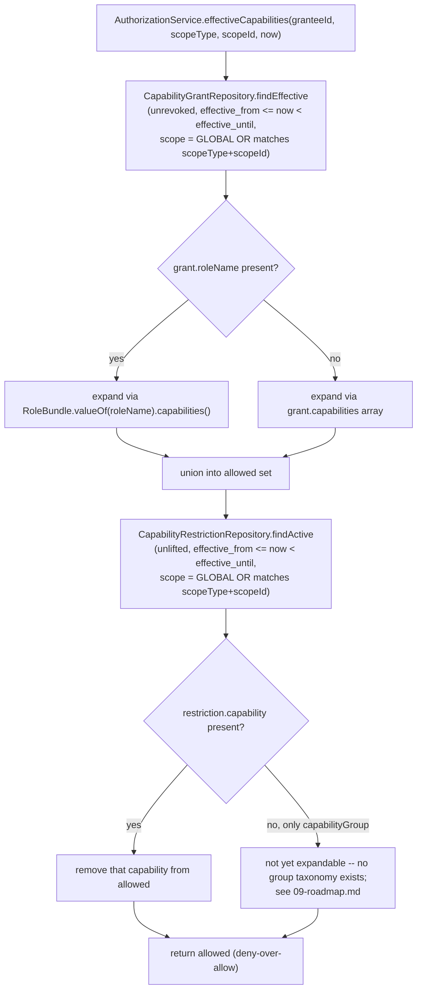
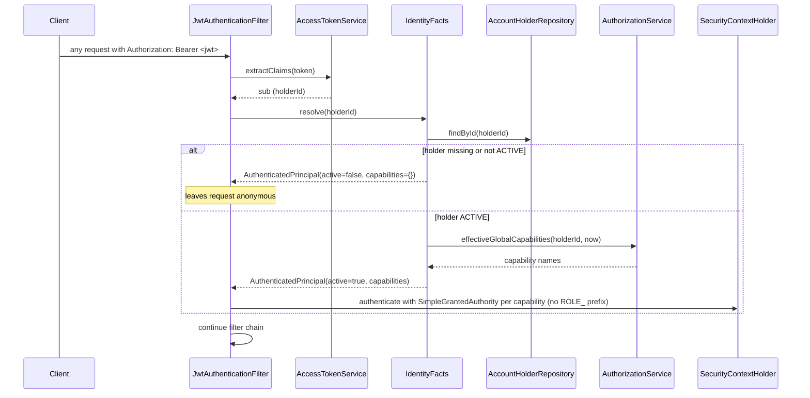

# Authorization

This document is not one endpoint; it is the mechanism every protected endpoint depends on.

## Purpose

Decides, on every request, whether the authenticated principal may currently act — and what it may
do — without trusting anything the client's access token claims about it.

## Capability catalog

`Capability` (`identity.internal.service.authz`) is the single source of truth. `RoleBundle` groups
capabilities into the three named bundles a `capability_grants.role_name` can carry:

| Bundle | Capabilities |
| --- | --- |
| `GUEST` | `BOOKING_CREATE`, `BOOKING_CANCEL_OWN`, `REVIEW_WRITE_OWN`, `MESSAGE_SEND` |
| `HOST` | `CAN_DRAFT`, `CAN_PUBLISH`, `CAN_ACCEPT_BOOKING`, `CAN_RECEIVE_PAYOUT`, `LISTING_MANAGE_OWN`, `CALENDAR_MANAGE_OWN`, `MESSAGE_SEND` |
| `ADMIN` | `ACCOUNT_SUSPEND`, `ACCOUNT_REACTIVATE`, `CONFIGURATION_APPROVE`, `SUPPORT_CASE_MANAGE` |

Every live grant today carries a `role_name` and is `GLOBAL`-scoped; no code yet issues a
resource-scoped grant with only a raw `capabilities` array and no role label (see
[`09-roadmap.md`](09-roadmap.md)).

## Grants and evaluation

`AuthorizationService` is a pure decision function: it reads `capability_grants` and
`capability_restrictions` and never writes either. `CapabilityGrantService` is the only writer of
grants; nothing in this codebase writes a restriction yet.

## The per-request reload

## Rules and invariants

- **The JWT carries no `roles` claim.** It is not authoritative and would only invite a client to
  trust a fifteen-minute-old snapshot; `sub` (holder id) and `sid` (session id) are the only
  identity claims.
- **A suspended or closed account is denied on the very next request**, not merely once its access
  token expires — this is the fix `IdentityFacts` exists to deliver. Before it, the filter built
  authorities purely from the JWT's own claims and never touched the database.
- **Deny-over-allow.** A restriction is subtracted after grants are unioned, so it can suppress a
  capability without touching the grant that explains why the principal once had it — lifting the
  restriction later needs no new grant.
- **`SecurityConfig` checks authorities, not roles.** `/api/v1/admin/**` requires
  `hasAuthority("ACCOUNT_SUSPEND")`, not `hasRole("ADMIN")`; no controller is mounted under that
  prefix yet.
- Revoking a delegation (`CapabilityGrantService.revoke`) cascades through
  `derived_from_grant_id`, but nothing yet creates a derived grant — the cascade exists for the
  delegation roadmap item to rely on without revisiting this method.

## Status

Implemented for `GLOBAL`-scoped grants, single-capability restrictions, and the per-request reload.
Resource-scoped grants, capability-group restrictions, and delegation cascades are wired but unused
— see [`09-roadmap.md`](09-roadmap.md).
