# Docker Fundamentals

> Docker là một công cụ giúp đóng gói ứng dụng cùng với các dependency và môi trường cần thiết để ứng dụng có thể chạy ổn định ở nhiều máy khác nhau.

---

## 1. Docker là gì?

Hãy tưởng tượng bạn viết một ứng dụng Java.

Ở máy của bạn:

```text
Java 21
Maven 3.9
Spring Boot
PostgreSQL 16
Redis
Environment variables
Application configuration
```

Ứng dụng chạy ngon.

Bạn đưa source code cho một developer khác.

Người đó chạy:

```bash
mvn clean package
```

Nhưng gặp:

```text
Java version không đúng
Maven version khác
PostgreSQL chưa cài
Redis chưa cài
Environment variable thiếu
Configuration khác
```

Đây là một vấn đề rất phổ biến:

> "It works on my machine."

Docker giải quyết vấn đề này bằng cách **đóng gói ứng dụng và môi trường chạy của ứng dụng thành một đơn vị có thể di chuyển được**.

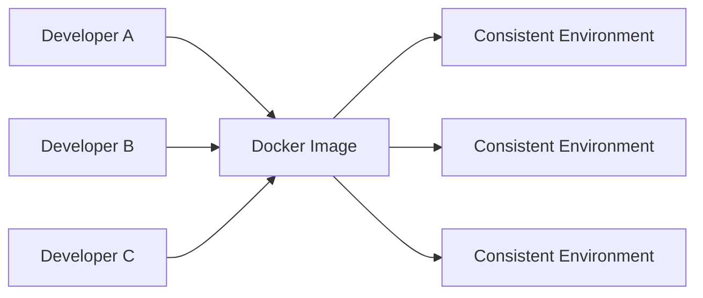

---

# 2. Tại sao cần Docker?

## 2.1. Vấn đề trước Docker

Giả sử có một Java application:

```text
my-app/
├── source code
├── Java
├── Maven
├── PostgreSQL
├── Redis
└── configuration
```

Developer A dùng:

```text
Ubuntu
Java 21
PostgreSQL 16
Redis 7
```

Developer B dùng:

```text
Windows
Java 17
PostgreSQL 15
Redis 6
```

Developer C dùng:

```text
macOS
Java 21
PostgreSQL 16
Redis chưa cài
```

Cùng một source code nhưng môi trường khác nhau có thể dẫn đến behavior khác nhau.

---

## 2.2. Docker giải quyết như thế nào?

Thay vì yêu cầu máy host phải cài toàn bộ dependency, chúng ta mô tả môi trường bằng code.

Ví dụ:

```dockerfile
FROM eclipse-temurin:21-jre

COPY app.jar /app/app.jar

ENTRYPOINT ["java", "-jar", "/app/app.jar"]
```

Sau đó build thành image:

```bash
docker build -t my-app .
```

Chạy:

```bash
docker run my-app
```

Docker sẽ tạo một environment tương đối nhất quán để chạy application.

---

# 3. Virtual Machine vs Docker

Đây là một trong những khái niệm quan trọng nhất.

## 3.1. Virtual Machine

VM thường có:

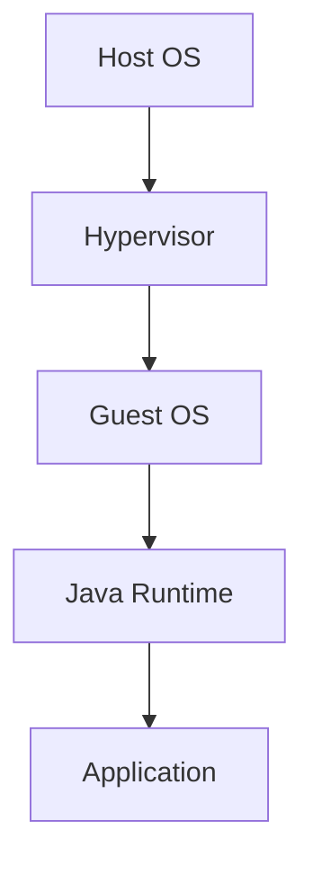

Mỗi VM có một operating system riêng.

Ví dụ:

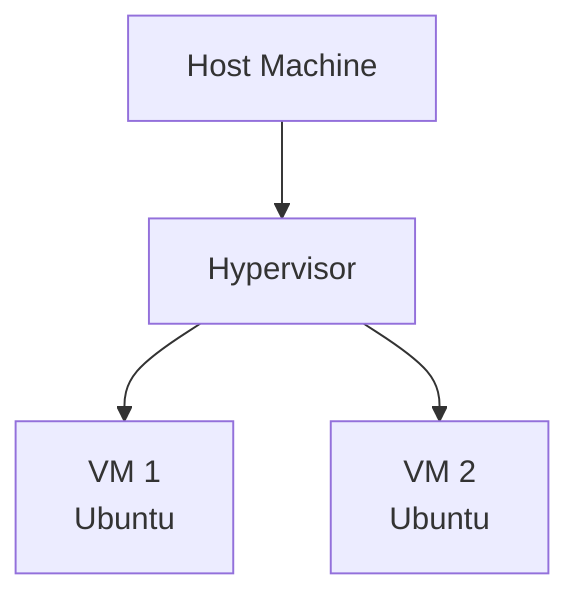

Điều này tạo overhead tương đối lớn.

---

## 3.2. Docker Container

Docker container sử dụng kernel của hệ điều hành host thông qua container runtime.

Mô hình đơn giản:

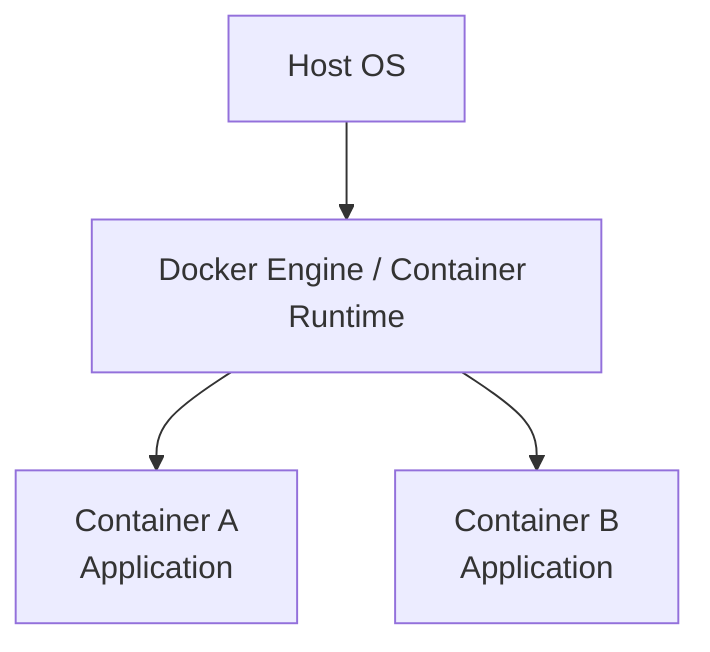

Container không phải là một VM đầy đủ.

Điểm quan trọng:

> Container là một process được isolation khỏi các process khác bằng các cơ chế của OS.

Vì vậy container thường:

* nhẹ hơn VM
* start nhanh
* dễ tạo/xóa
* dễ scale
* phù hợp với CI/CD
* phù hợp với microservices

---

# 4. Docker Architecture

Có thể hình dung Docker theo mô hình:

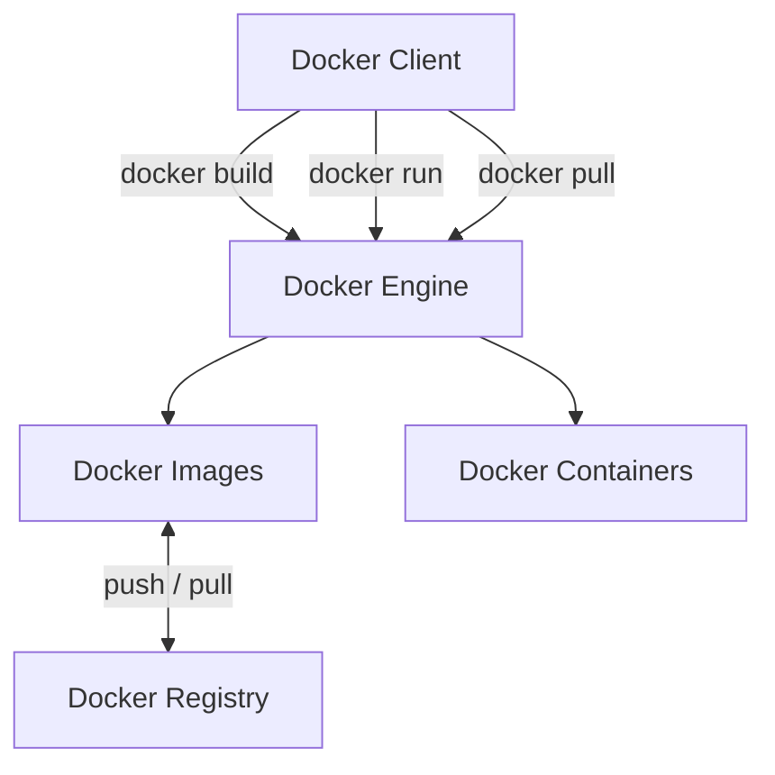

Ví dụ:

```bash
docker pull postgres:16
```

Docker client gửi request đến Docker Engine.

Docker Engine lấy image từ registry.

Sau đó:

```bash
docker run postgres:16
```

Docker Engine tạo container từ image đó.

---

# 5. Các khái niệm quan trọng

Có một số khái niệm cần phân biệt rõ:

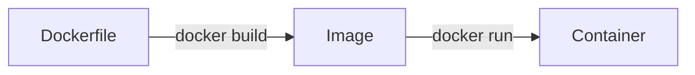

Ngoài ra còn:

```text
Registry
Volume
Network
Docker Compose
Environment Variables
```

---

# 6. Docker Image

## Image là gì?

Image là một **immutable template** dùng để tạo container.

Ví dụ:

```text
postgres:16
redis:7
nginx:latest
eclipse-temurin:21-jre
```

Có thể hiểu đơn giản:

> Image = bản mẫu
> Container = instance được tạo từ bản mẫu

Ví dụ:

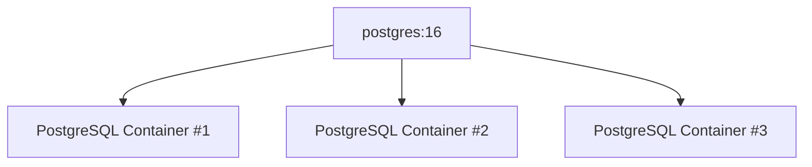

Một image có thể tạo ra nhiều container.

---

# 7. Container

Container là một instance đang chạy của image.

Ví dụ:

```bash
docker run nginx
```

Docker sẽ:

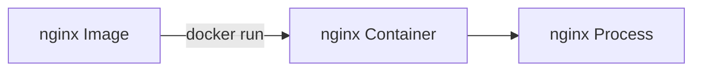

Xem container:

```bash
docker ps
```

Xem cả container đã stopped:

```bash
docker ps -a
```

---

# 8. Image và Container khác nhau thế nào?

| Image                    | Container         |
| ------------------------ | ----------------- |
| Template                 | Instance          |
| Immutable                | Runtime state     |
| Dùng để tạo container    | Được tạo từ image |
| Có thể push lên registry | Có thể start/stop |
| Ví dụ `nginx:1.27`       | Ví dụ `my-nginx`  |

Ví dụ:

```bash
docker pull nginx:1.27
```

Image được download.

Sau đó:

```bash
docker run --name my-nginx nginx:1.27
```

Container được tạo.

---

# 9. Dockerfile

Dockerfile là file dùng để mô tả cách build image.

Ví dụ Java application:

```dockerfile
FROM eclipse-temurin:21-jre

WORKDIR /app

COPY target/app.jar app.jar

EXPOSE 8080

ENTRYPOINT ["java", "-jar", "app.jar"]
```

Build:

```bash
docker build -t my-app:1.0 .
```

---

# 10. Giải thích Dockerfile

## 10.1. FROM

```dockerfile
FROM eclipse-temurin:21-jre
```

Chọn base image.

Có thể hiểu:

```text
eclipse-temurin:21-jre
├── Linux userspace
├── Java 21
└── JRE
```

---

## 10.2. WORKDIR

```dockerfile
WORKDIR /app
```

Đặt working directory:

```text
/app
```

Các command sau đó sẽ thực hiện tương đối với directory này.

---

## 10.3. COPY

```dockerfile
COPY target/app.jar app.jar
```

Copy file từ build context vào image.

```mermaid
flowchart LR
    Host[Host]
    Jar[target/app.jar]

    Build[docker build]

    Image[Docker Image]
    AppJar[/app/app.jar]

    Host --> Jar
    Jar --> Build
    Build --> Image
    Image --> AppJar
```

---

## 10.4. EXPOSE

```dockerfile
EXPOSE 8080
```

Documentation cho biết application sử dụng port 8080.

Lưu ý:

> `EXPOSE` không tự động publish port ra host.

Muốn truy cập từ host cần dùng `-p`.

Ví dụ:

```bash
docker run -p 8080:8080 my-app
```

---

## 10.5. ENTRYPOINT

```dockerfile
ENTRYPOINT ["java", "-jar", "app.jar"]
```

Command mặc định khi container start.

---

# 11. Docker Build

Giả sử project:

```text
my-app/
├── Dockerfile
├── pom.xml
└── target/
    └── app.jar
```

Build:

```bash
docker build -t my-app:1.0 .
```

Giải thích:

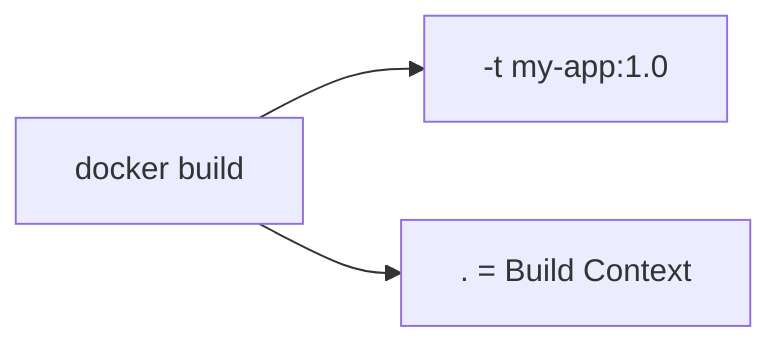

Trong đó:

* `my-app` = image name
* `1.0` = tag
* `.` = build context

Kiểm tra image:

```bash
docker images
```

---

# 12. Docker Run

Chạy container:

```bash
docker run my-app:1.0
```

Chạy background:

```bash
docker run -d my-app:1.0
```

Trong đó:

```text
-d = detached mode
```

Xem container:

```bash
docker ps
```

---

# 13. Port Mapping

Giả sử Spring Boot chạy:

```text
Container: 8080
```

Container có network namespace riêng.

Host không tự động truy cập được port đó.

Ta publish:

```bash
docker run -p 8080:8080 my-app
```

Cú pháp:

```text
-p HOST_PORT:CONTAINER_PORT
```

Ví dụ:

```bash
docker run -p 9000:8080 my-app
```

Mapping:

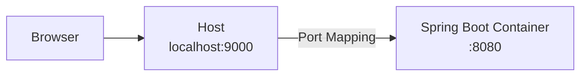

Request:

```text
http://localhost:9000
```

được forward đến:

```text
container:8080
```

---

# 14. Container Lifecycle

Một container có lifecycle:

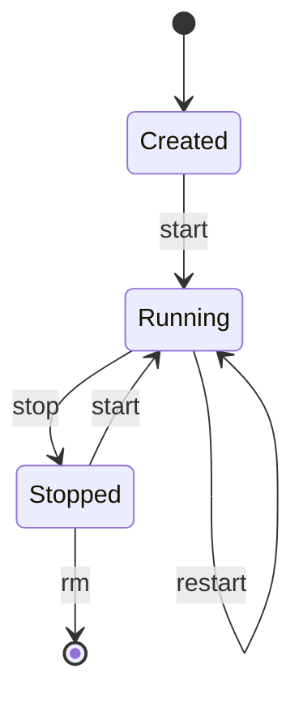

Các command thường dùng:

```bash
docker start my-app
docker stop my-app
docker restart my-app
```

Xóa:

```bash
docker rm my-app
```

Force remove:

```bash
docker rm -f my-app
```

---

# 15. Xem Logs

Một trong những command quan trọng nhất:

```bash
docker logs my-app
```

Follow logs:

```bash
docker logs -f my-app
```

Ví dụ:

```bash
docker logs -f my-app
```

rất hữu ích khi debug Spring Boot application.

---

# 16. Execute command bên trong container

Có thể mở shell:

```bash
docker exec -it my-app sh
```

Nếu image có bash:

```bash
docker exec -it my-app bash
```

Ví dụ:

```bash
docker exec -it my-app sh
```

Sau đó:

```bash
ls
```

```bash
env
```

```bash
ps
```

---

# 17. Environment Variables

Application thường cần configuration.

Ví dụ:

```text
DB_HOST
DB_PORT
DB_USERNAME
DB_PASSWORD
```

Có thể truyền environment variable:

```bash
docker run \
  -e DB_HOST=postgres \
  -e DB_PORT=5432 \
  -e DB_USERNAME=app \
  my-app
```

Trong Spring Boot có thể sử dụng:

```properties
spring.datasource.url=jdbc:postgresql://${DB_HOST}:${DB_PORT}/app
```

---

# 18. Không nên hard-code configuration

Không nên:

```dockerfile
ENV DB_PASSWORD=123456
```

Đặc biệt với secret.

Không nên commit:

```text
password
API key
private key
production secret
```

vào Git repository hoặc Docker image.

Production thường sử dụng secret management như:

```text
Kubernetes Secrets
AWS Secrets Manager
HashiCorp Vault
Azure Key Vault
GCP Secret Manager
```

---

# 19. Docker Volume

Đây là concept cực kỳ quan trọng.

Container có filesystem riêng.

Ví dụ:

```mermaid
flowchart TB
    Container[Container]
    App[/app]
    Tmp[/tmp]
    Data[/data]

    Container --> App
    Container --> Tmp
    Container --> Data
```

Nếu container bị remove:

```bash
docker rm my-container
```

thì dữ liệu bên trong writable layer của container cũng mất.

Điều này đặc biệt nguy hiểm với database.

---

# 20. Volume dùng để làm gì?

Volume tách data khỏi lifecycle của container.

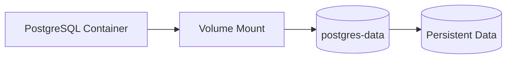

Tạo volume:

```bash
docker volume create postgres-data
```

Chạy PostgreSQL:

```bash
docker run \
  --name postgres \
  -v postgres-data:/var/lib/postgresql/data \
  postgres:16
```

Nếu container bị xóa:

```bash
docker rm postgres
```

Volume vẫn tồn tại.

---

# 21. Bind Mount

Ngoài named volume, Docker có bind mount.

Ví dụ:

```bash
docker run \
  -v $(pwd):/app \
  my-app
```

Mapping:

```mermaid
flowchart LR
    Host[Host]
    Source[./]
    Container[Container]
    App[/app]

    Host --> Source
    Source -->|Bind Mount| App
    App --> Container
```

Bind mount thường hữu ích trong development.

Ví dụ:

```text
Source code trên host
        |
        v
Container
```

---

# 22. Volume vs Bind Mount

|                         | Volume      | Bind Mount     |
| ----------------------- | ----------- | -------------- |
| Docker quản lý          | Có          | Không          |
| Host path cụ thể        | Không cần   | Cần            |
| Database data           | Rất phù hợp | Có thể         |
| Development source code | Ít dùng hơn | Rất phổ biến   |
| Portability             | Tốt hơn     | Phụ thuộc host |

---

# 23. Docker Network

Các container có thể giao tiếp với nhau thông qua Docker network.

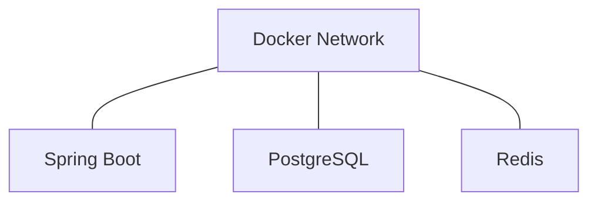

Tạo network:

```bash
docker network create app-network
```

Chạy PostgreSQL:

```bash
docker run \
  --name postgres \
  --network app-network \
  postgres:16
```

Chạy application:

```bash
docker run \
  --name app \
  --network app-network \
  my-app
```

Application có thể connect đến:

```text
postgres:5432
```

Không nhất thiết phải dùng IP.

---

# 24. Container DNS

Trong Docker network, container có thể tìm container khác bằng name.

Ví dụ:

```bash
docker run --name postgres ...
```

Application có thể dùng:

```text
DB_HOST=postgres
```

thay vì:

```text
DB_HOST=192.168.x.x
```

Concept này rất quan trọng khi chạy nhiều service.

```mermaid
flowchart LR
    App[Spring Boot]
    DNS[Docker DNS]
    DB[postgres]

    App -->|resolve "postgres"| DNS
    DNS --> DB
```

---

# 25. Docker Compose

Khi application có nhiều service:

```text
Spring Boot
PostgreSQL
Redis
Kafka
RabbitMQ
```

chạy từng container bằng command dài sẽ rất bất tiện.

Docker Compose giải quyết vấn đề này.

Ví dụ:

```yaml
services:

  app:
    image: my-app:1.0
    ports:
      - "8080:8080"
    depends_on:
      - postgres
      - redis

  postgres:
    image: postgres:16
    environment:
      POSTGRES_DB: app
      POSTGRES_USER: app
      POSTGRES_PASSWORD: password
    volumes:
      - postgres-data:/var/lib/postgresql/data

  redis:
    image: redis:7

volumes:
  postgres-data:
```

Compose mô hình hóa toàn bộ application stack:

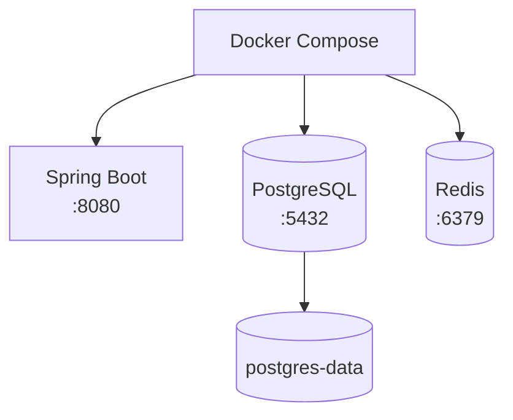

---

# 26. Chạy Docker Compose

Start:

```bash
docker compose up
```

Background:

```bash
docker compose up -d
```

Stop:

```bash
docker compose down
```

Xem logs:

```bash
docker compose logs
```

Follow logs:

```bash
docker compose logs -f
```

Build:

```bash
docker compose build
```

Build + start:

```bash
docker compose up --build
```

---

# 27. Một ứng dụng Spring Boot thực tế

Giả sử architecture:

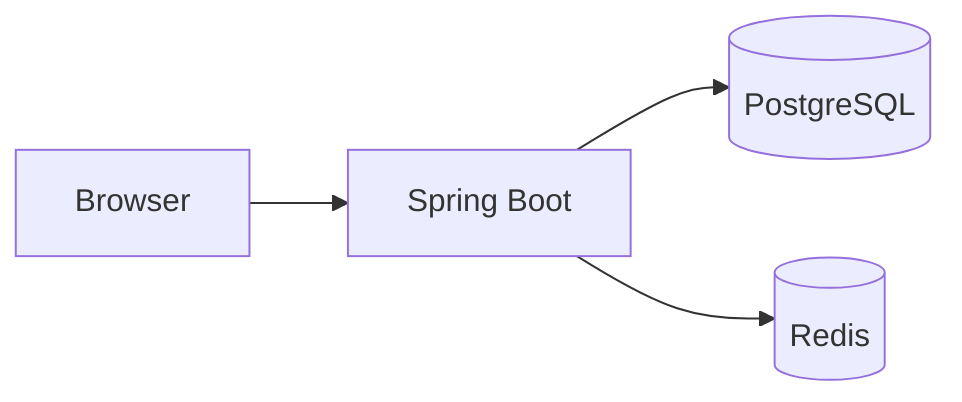

Docker Compose có thể mô hình hóa:

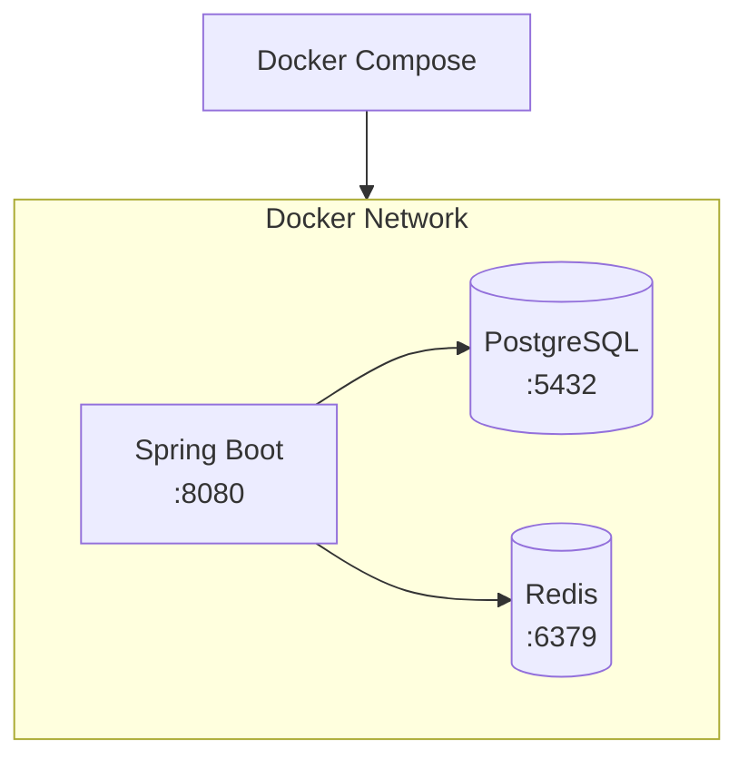

---

# 28. Multi-stage Build

Một Dockerfile tốt cho Java application thường sử dụng multi-stage build.

Ví dụ:

```dockerfile
FROM maven:3.9-eclipse-temurin-21 AS build

WORKDIR /build

COPY pom.xml .

RUN mvn dependency:go-offline

COPY src ./src

RUN mvn clean package -DskipTests
```

Sau đó runtime image:

```dockerfile
FROM eclipse-temurin:21-jre

WORKDIR /app

COPY --from=build /build/target/*.jar app.jar

ENTRYPOINT ["java", "-jar", "app.jar"]
```

Toàn bộ:

```dockerfile
FROM maven:3.9-eclipse-temurin-21 AS build

WORKDIR /build

COPY pom.xml .

RUN mvn dependency:go-offline

COPY src ./src

RUN mvn clean package -DskipTests


FROM eclipse-temurin:21-jre

WORKDIR /app

COPY --from=build /build/target/*.jar app.jar

EXPOSE 8080

ENTRYPOINT ["java", "-jar", "app.jar"]
```

---

# 29. Tại sao Multi-stage Build?

Nếu chỉ dùng:

```text
Maven image
+
Source code
+
Maven
+
JDK
+
Application
```

runtime image có thể rất lớn.

Trong production, application thường chỉ cần:

```text
Java Runtime
+
app.jar
```

Multi-stage build:

```mermaid
flowchart LR
    Build[Build Stage]

    Maven[Maven]
    JDK[JDK]
    Source[Source Code]
    Dependencies[Dependencies]

    Runtime[Runtime Stage]
    JRE[JRE]
    Jar[app.jar]

    Build --> Maven
    Build --> JDK
    Build --> Source
    Build --> Dependencies

    Build -->|Build artifact| Runtime
    Runtime --> JRE
    Runtime --> Jar
```

Kết quả:

* image nhỏ hơn
* attack surface nhỏ hơn
* deployment nhanh hơn
* production image sạch hơn

---

# 30. Docker Layer

Docker image được xây dựng từ nhiều layer.

Ví dụ:

```dockerfile
FROM eclipse-temurin:21-jre

WORKDIR /app

COPY app.jar app.jar

ENTRYPOINT ["java", "-jar", "app.jar"]
```

Có thể hình dung:

```mermaid
flowchart TB
    L3[Layer 3<br/>app.jar]
    L2[Layer 2<br/>WORKDIR /app]
    L1[Layer 1<br/>Java Runtime]
    L0[Base Filesystem]

    L0 --> L1
    L1 --> L2
    L2 --> L3
```

Các layer có thể được cache và reuse.

---

# 31. Docker Build Cache

Ví dụ:

```dockerfile
COPY pom.xml .

RUN mvn dependency:go-offline

COPY src ./src

RUN mvn package
```

Tách:

```text
pom.xml
```

ra trước source code giúp Docker cache dependency layer.

Nếu chỉ sửa:

```text
src/main/java/...
```

thì Docker có thể reuse:

```text
dependency layer
```

thay vì download dependency lại.

Workflow:

```mermaid
flowchart TB
    Pom[pom.xml]
    Dependency[Download Dependencies]
    Source[src/]
    Package[mvn package]
    Image[Docker Image]

    Pom --> Dependency
    Dependency --> Source
    Source --> Package
    Package --> Image
```

Đây là optimization rất quan trọng cho CI/CD.

---

# 32. `.dockerignore`

Giống `.gitignore`.

Ví dụ:

```text
.git
.idea
*.iml
target
node_modules
README.md
```

Docker build context sẽ không gửi các file này.

Điều này giúp:

* giảm build context
* build nhanh hơn
* tránh copy file không cần thiết
* tránh vô tình đưa secret vào image

---

# 33. Docker Registry

Image cần được lưu trữ ở đâu đó để các server khác có thể pull.

Đó là registry.

Ví dụ:

```text
Docker Hub
GitHub Container Registry
AWS ECR
Google Artifact Registry
Azure Container Registry
Harbor
```

Workflow:

```mermaid
flowchart LR
    Developer[Developer]

    Build[docker build]
    Image[Docker Image]
    Registry[Container Registry]
    Production[Production]
    Container[Production Container]

    Developer --> Build
    Build --> Image
    Image -->|docker push| Registry
    Registry -->|docker pull| Production
    Production --> Container
```

Ví dụ:

```bash
docker tag my-app:1.0 username/my-app:1.0
```

Push:

```bash
docker push username/my-app:1.0
```

Pull:

```bash
docker pull username/my-app:1.0
```

---

# 34. Image Tag

Ví dụ:

```text
my-app:1.0
```

Trong đó:

```text
my-app = repository
1.0     = tag
```

Có thể có:

```text
my-app:1.0
my-app:1.1
my-app:2.0
my-app:latest
```

Trong production nên ưu tiên version/tag immutable hoặc commit SHA thay vì phụ thuộc vào:

```text
latest
```

Ví dụ:

```text
my-app:2026.09.12
```

hoặc:

```text
my-app:a83f91c
```

---

# 35. Docker Command Cheat Sheet

## Images

```bash
docker images

docker pull nginx:latest

docker build -t my-app:1.0 .

docker rmi my-app:1.0

docker image inspect my-app:1.0
```

## Containers

```bash
docker ps

docker ps -a

docker run my-app

docker start my-app

docker stop my-app

docker restart my-app

docker rm my-app

docker inspect my-app
```

## Logs

```bash
docker logs my-app

docker logs -f my-app
```

## Execute

```bash
docker exec -it my-app sh
```

## Network

```bash
docker network ls

docker network create app-network

docker network inspect app-network
```

## Volume

```bash
docker volume ls

docker volume create app-data

docker volume inspect app-data
```

---

# 36. Những command nên nhớ đầu tiên

Nếu mới học Docker, chưa cần nhớ tất cả.

Chỉ cần nắm:

```bash
docker build
docker run
docker ps
docker stop
docker rm
docker images
docker logs
docker exec
docker pull
docker push
```

Sau đó học:

```bash
docker compose
docker network
docker volume
```

---

# 37. Debug Docker Container

Khi container không chạy:

## Bước 1: Kiểm tra container

```bash
docker ps -a
```

---

## Bước 2: Xem logs

```bash
docker logs my-app
```

---

## Bước 3: Inspect

```bash
docker inspect my-app
```

Kiểm tra:

```text
Environment
Network
Mounts
Ports
Command
Status
```

---

## Bước 4: Vào container

```bash
docker exec -it my-app sh
```

Kiểm tra:

```bash
env
```

```bash
ls -la
```

---

## Bước 5: Kiểm tra network

```bash
docker network inspect app-network
```

---

# 38. Những lỗi Docker người mới thường gặp

## Lỗi 1: Port already allocated

```text
Bind for 0.0.0.0:8080 failed:
port is already allocated
```

Có nghĩa host port `8080` đang được sử dụng.

Có thể đổi:

```bash
docker run -p 8081:8080 my-app
```

---

## Lỗi 2: Container exit ngay lập tức

Kiểm tra:

```bash
docker ps -a
```

Sau đó:

```bash
docker logs my-app
```

Một container sẽ tồn tại miễn là main process của nó còn chạy.

```mermaid
flowchart LR
    Container[Container]
    Process[Main Process]
    Running[Container Running]
    Exit[Process Exits]
    Stopped[Container Stops]

    Container --> Process
    Process --> Running
    Running --> Exit
    Exit --> Stopped
```

---

## Lỗi 3: Application không connect database

Không nên dùng:

```text
localhost:5432
```

từ container application để connect container PostgreSQL.

Trong Docker network, nên dùng:

```text
postgres:5432
```

---

# 39. `localhost` trong Docker

Đây là lỗi rất phổ biến.

Nếu Spring Boot chạy trong container:

```text
localhost
```

thường có nghĩa:

```text
chính container Spring Boot
```

Không phải:

```text
Host machine
```

Sai:

```mermaid
flowchart LR
    App[Spring Boot Container]
    Localhost[localhost:5432]
    DB[PostgreSQL Container]

    App --> Localhost
    Localhost -.X.-> DB
```

Đúng:

```mermaid
flowchart LR
    App[Spring Boot Container]
    DB[PostgreSQL Container<br/>postgres:5432]

    App --> DB
```

---

# 40. Docker và Microservices

Docker không phải là microservices.

Đây là hai khái niệm khác nhau.

Docker là:

```text
Containerization technology
```

Microservices là:

```text
Architectural style
```

Tuy nhiên Docker rất phù hợp để deploy microservices.

Ví dụ:

```mermaid
flowchart LR
    Gateway[API Gateway]

    User[User Service]
    Order[Order Service]
    Payment[Payment Service]

    DB[(Database)]

    Gateway --> User
    Gateway --> Order
    Gateway --> Payment

    User --> DB
    Order --> DB
    Payment --> DB
```

Mỗi service có thể được đóng gói thành image riêng:

```text
user-service:1.0
order-service:1.0
payment-service:1.0
```

---

# 41. Docker không phải Production Orchestrator

Docker rất tốt để:

```text
Build
Package
Run
Distribute
```

Nhưng khi hệ thống lớn, bạn có thể cần orchestration.

Ví dụ:

```text
Docker
   |
   v
Kubernetes
```

Kubernetes giải quyết các vấn đề như:

* scheduling
* service discovery
* rolling deployment
* self-healing
* scaling
* load balancing
* configuration
* secrets
* health checks

Có thể hình dung:

```mermaid
flowchart TB
    Docker[Docker / Container Runtime]

    K8s[Kubernetes]

    Scheduling[Scheduling]
    Discovery[Service Discovery]
    Deployment[Rolling Deployment]
    Healing[Self-Healing]
    Scaling[Scaling]
    LoadBalancing[Load Balancing]

    Docker --> K8s

    K8s --> Scheduling
    K8s --> Discovery
    K8s --> Deployment
    K8s --> Healing
    K8s --> Scaling
    K8s --> LoadBalancing
```

---

# 42. Docker trong CI/CD

Một workflow phổ biến:

```mermaid
flowchart LR
    Developer[Developer]
    Git[Git Push]
    CI[CI Pipeline]

    Test[mvn test]
    Build[docker build]
    Scan[Security Scan]
    Push[docker push]

    Registry[Container Registry]
    Deploy[Deployment]
    Production[Production]

    Developer --> Git
    Git --> CI
    CI --> Test
    Test --> Build
    Build --> Scan
    Scan --> Push
    Push --> Registry
    Registry --> Deploy
    Deploy --> Production
```

Ví dụ image:

```text
my-app:a83f91c
```

Deployment sử dụng chính image đó.

Điều này giúp đảm bảo:

```text
Artifact được test
        =
Artifact được deploy
```

---

# 43. Docker Best Practices

## 43.1. Image càng nhỏ càng tốt

Ưu tiên runtime image nhỏ.

Ví dụ:

```dockerfile
FROM eclipse-temurin:21-jre
```

thay vì đưa cả Maven/JDK/build tool vào production image nếu không cần.

---

## 43.2. Không chạy application bằng root nếu không cần

Có thể tạo user riêng:

```dockerfile
RUN useradd appuser

USER appuser
```

---

## 43.3. Không hard-code secret

Không:

```dockerfile
ENV DB_PASSWORD=secret123
```

---

## 43.4. Pin version

Tránh phụ thuộc mơ hồ:

```dockerfile
FROM some-image:latest
```

Ưu tiên version cụ thể:

```dockerfile
FROM eclipse-temurin:21-jre
```

Trong môi trường yêu cầu reproducibility cao, có thể pin digest:

```text
image@sha256:...
```

---

## 43.5. Dùng `.dockerignore`

Giúp tránh build context không cần thiết.

---

## 43.6. Container nên có một responsibility rõ ràng

Thay vì:

```text
Container
├── Spring Boot
├── PostgreSQL
├── Redis
└── Nginx
```

thường nên:

```mermaid
flowchart LR
    App[Spring Boot Container]
    DB[PostgreSQL Container]
    Redis[Redis Container]
    Nginx[Nginx Container]

    App --- DB
    App --- Redis
    Nginx --- App
```

Mỗi container đảm nhận một responsibility rõ ràng.

---

# 44. Mental Model quan trọng nhất

Nếu chỉ nhớ một mô hình, hãy nhớ:

```mermaid
flowchart TB
    Dockerfile[Dockerfile]

    Image[Docker Image]
    Container[Docker Container]

    Network[Docker Network]
    Volume[Docker Volume]
    Env[Environment Variables]

    Dockerfile -->|docker build| Image
    Image -->|docker run| Container

    Container --- Network
    Container --- Volume
    Container --- Env
```

Còn khi có nhiều container:

```mermaid
flowchart TB
    Compose[Docker Compose]

    subgraph Network["Docker Network"]
        App[Spring Boot]
        DB[(PostgreSQL)]
        Redis[(Redis)]

        App --> DB
        App --> Redis
    end

    Volume[(PostgreSQL Volume)]

    Compose --> Network
    DB --> Volume
```

---

# 45. Learning Path

Nếu bắt đầu từ zero, nên học theo thứ tự:

```mermaid
flowchart TB
    C1["1. Docker Concept"]
    C2["2. Image / Container"]
    C3["3. Dockerfile"]
    C4["4. docker build"]
    C5["5. docker run"]
    C6["6. Port Mapping"]
    C7["7. Environment Variables"]
    C8["8. Volume"]
    C9["9. Network"]
    C10["10. Docker Compose"]
    C11["11. Multi-stage Build"]
    C12["12. Registry"]
    C13["13. CI/CD"]
    C14["14. Kubernetes"]

    C1 --> C2
    C2 --> C3
    C3 --> C4
    C4 --> C5
    C5 --> C6
    C6 --> C7
    C7 --> C8
    C8 --> C9
    C9 --> C10
    C10 --> C11
    C11 --> C12
    C12 --> C13
    C13 --> C14
```

---

# 46. Bài tập thực hành

## Bài 1 — Chạy Nginx

```bash
docker run -d --name nginx -p 8080:80 nginx
```

Mở:

```text
http://localhost:8080
```

Kiểm tra:

```bash
docker ps
```

```bash
docker logs nginx
```

Stop:

```bash
docker stop nginx
```

Remove:

```bash
docker rm nginx
```

---

## Bài 2 — Chạy Redis

```bash
docker run -d --name redis redis:7
```

Kiểm tra:

```bash
docker ps
```

Vào Redis:

```bash
docker exec -it redis redis-cli
```

Test:

```text
SET name docker
GET name
```

---

## Bài 3 — Dockerize Spring Boot

Tạo:

```text
Dockerfile
```

```dockerfile
FROM eclipse-temurin:21-jre

WORKDIR /app

COPY target/app.jar app.jar

EXPOSE 8080

ENTRYPOINT ["java", "-jar", "app.jar"]
```

Build:

```bash
docker build -t spring-app:1.0 .
```

Run:

```bash
docker run -p 8080:8080 spring-app:1.0
```

---

## Bài 4 — Spring Boot + PostgreSQL

Tạo:

```text
docker-compose.yml
```

với:

```text
app
postgres
```

Sau đó cho Spring Boot connect:

```text
postgres:5432
```

Mục tiêu:

```mermaid
flowchart LR
    Browser[Browser]
    App[Spring Boot]
    DB[(PostgreSQL)]

    Browser --> App
    App --> DB
```

---

# 47. Kết luận

Docker không đơn giản chỉ là:

```bash
docker run
```

Mà nên hiểu Docker qua các layer concept:

```mermaid
flowchart TB
    Docker[Docker]

    Image[Image]
    Container[Container]
    Registry[Registry]
    Network[Network]
    Volume[Volume]
    Compose[Docker Compose]

    Docker --> Image
    Docker --> Container
    Docker --> Registry
    Docker --> Network
    Docker --> Volume
    Docker --> Compose
```

Nếu hiểu được các khái niệm:

```text
Image
Container
Dockerfile
Port
Network
Volume
Environment
Registry
Compose
```

thì bạn đã có nền tảng đủ tốt để bắt đầu dùng Docker trong project thực tế.

Đối với Java/Spring Boot, workflow quan trọng nhất cần nắm là:

```mermaid
flowchart LR
    Spring[Spring Boot]
    Package[mvn package]
    Jar[app.jar]
    Build[docker build]
    Image[Docker Image]
    Push[docker push]
    Registry[Container Registry]
    Pull[docker pull]
    Production[Production]
    Container[Container]

    Spring --> Package
    Package --> Jar
    Jar --> Build
    Build --> Image
    Image --> Push
    Push --> Registry
    Registry --> Pull
    Pull --> Production
    Production --> Container
```

Và khi có nhiều service:

```mermaid
flowchart TB
    Compose[Docker Compose]

    subgraph Network["Docker Network"]
        App[Spring Boot]
        DB[(PostgreSQL)]
        Redis[(Redis)]

        App --> DB
        App --> Redis
    end

    Compose --> Network
```

## Docker mindset

> **Build once → Package once → Run consistently everywhere.**
