# Vue.js cho người mới

> Tài liệu nhập môn Vue.js dành cho người đã biết JavaScript cơ bản và muốn hiểu **Vue dùng để làm gì, hoạt động như thế nào, các khái niệm cốt lõi và cách xây dựng một ứng dụng Vue thực tế**.

---

## 1. Vue.js là gì?

**Vue.js** là một JavaScript framework dùng để xây dựng **User Interface (UI)** và các ứng dụng web.

Nói đơn giản:

```text
JavaScript thuần
    ↓
Tự tìm element
    ↓
Tự thay đổi DOM
    ↓
Tự quản lý state
    ↓
Tự xử lý event
    ↓
Code nhanh trở nên khó quản lý
```

Vue cung cấp một cách tổ chức tốt hơn:

```text
State
  ↓
Vue
  ↓
UI
  ↑
Event
```

Bạn chủ yếu mô tả:

> "Nếu dữ liệu hiện tại là X thì giao diện phải trông như Y."

Vue sẽ đảm nhiệm phần cập nhật DOM khi dữ liệu thay đổi.

---

# 2. Tại sao cần Vue?

Hãy tưởng tượng một ứng dụng có:

* danh sách sản phẩm
* giỏ hàng
* đăng nhập
* filter
* pagination
* modal
* form
* loading
* error
* API
* nhiều màn hình

Nếu dùng JavaScript thuần, bạn sẽ phải tự quản lý rất nhiều thứ:

```javascript
document.querySelector('#username').textContent = user.name;

document.querySelector('#total').textContent = cart.total;

document.querySelector('#loading').style.display = 'none';
```

Khi ứng dụng lớn lên, code DOM manipulation trở nên khó kiểm soát.

Vue chuyển vấn đề thành:

```javascript
const user = ref({
  name: 'John'
});

const cartTotal = ref(100);
const loading = ref(false);
```

Template:

```vue
<template>
  <h1>{{ user.name }}</h1>

  <p>Total: {{ cartTotal }}</p>

  <Loading v-if="loading" />
</template>
```

Khi state thay đổi:

```javascript
user.value.name = 'Alice';
```

Vue tự cập nhật UI.

---

# 3. Mental model quan trọng nhất

Nếu chỉ nhớ một thứ về Vue, hãy nhớ:

```text
        State
          │
          ▼
     ┌─────────┐
     │   Vue   │
     └────┬────┘
          │
          ▼
          UI
          │
          │ User interaction
          ▼
        Event
          │
          ▼
      Update State
          │
          └──────────────► Vue cập nhật UI
```

Đây là mô hình:

**State → UI → Event → State → UI**

Ví dụ:

```text
count = 0
   ↓
UI hiển thị "0"
   ↓
User click +
   ↓
count = 1
   ↓
Vue phát hiện state thay đổi
   ↓
UI hiển thị "1"
```

---

# 4. Vue không phải là "magic"

Một lỗi phổ biến của người mới:

> "Vue tự biết khi nào dữ liệu thay đổi."

Không hoàn toàn.

Vue xây dựng một hệ thống **reactivity** để theo dõi việc đọc và thay đổi dữ liệu reactive.

Ví dụ:

```javascript
const count = ref(0);
```

Vue quản lý `count` thông qua cơ chế reactive.

Khi template sử dụng:

```vue
{{ count }}
```

Vue biết rằng UI này phụ thuộc vào `count`.

Khi:

```javascript
count.value++;
```

Vue biết:

```text
count đã thay đổi
       ↓
có những UI đang phụ thuộc vào count
       ↓
cập nhật những phần cần thiết
```

---

# 5. Reactivity là gì?

**Reactivity** nghĩa là:

> Khi dữ liệu thay đổi, những thứ phụ thuộc vào dữ liệu đó có thể phản ứng theo.

Ví dụ đời thường:

```text
Giá sản phẩm = 100
Số lượng = 2

Tổng tiền = 200
```

Nếu số lượng đổi:

```text
Số lượng = 3
```

thì:

```text
Tổng tiền = 300
```

Trong Vue:

```javascript
const price = ref(100);
const quantity = ref(2);

const total = computed(() => {
  return price.value * quantity.value;
});
```

`total` phụ thuộc vào:

```text
price
quantity
```

Khi một trong hai thay đổi:

```text
price / quantity
       ↓
   computed
       ↓
     total
       ↓
      UI
```

---

# 6. Component là gì?

Component là một **khối UI độc lập và có thể tái sử dụng**.

Ví dụ một trang:

```text
App
├── Header
├── Sidebar
├── ProductList
│   ├── ProductCard
│   ├── ProductCard
│   └── ProductCard
└── Footer
```

Thay vì viết tất cả trong một file:

```text
App.vue
```

ta chia nhỏ:

```text
App.vue
Header.vue
Sidebar.vue
ProductList.vue
ProductCard.vue
Footer.vue
```

---

# 7. Component tree

Vue application thường có cấu trúc dạng cây:

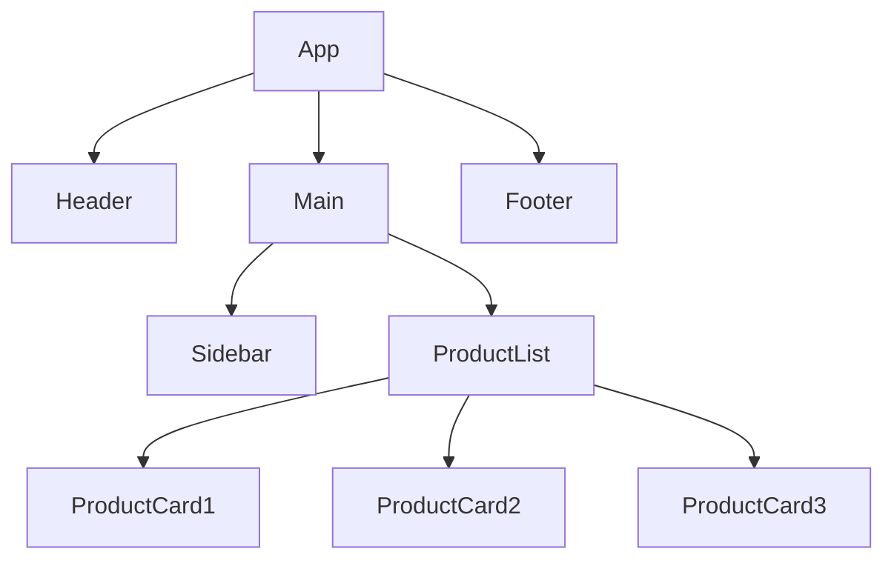

Mỗi component nên có **trách nhiệm tương đối rõ ràng**.

Ví dụ:

```text
ProductCard
    ↓
Hiển thị một sản phẩm
    ↓
Không nên chịu trách nhiệm:
    - load toàn bộ product
    - quản lý authentication
    - xử lý router toàn application
```

---

# 8. Single File Component — `.vue`

Một component Vue thường có dạng:

```vue
<script setup>
const message = 'Hello Vue';
</script>

<template>
  <h1>{{ message }}</h1>
</template>

<style scoped>
h1 {
  color: blue;
}
</style>
```

Một file `.vue` có thể gồm:

```text
<script>
    Logic
       │
       ▼
<template>
    UI
       │
       ▼
<style>
    Styling
```

---

# 9. `<script setup>` là gì?

Trong Vue 3, cách phổ biến hiện nay là:

```vue
<script setup>
</script>
```

thay vì:

```vue
<script>
export default {
  setup() {
    ...
  }
}
</script>
```

Ví dụ:

```vue
<script setup>
import { ref } from 'vue';

const count = ref(0);

function increment() {
  count.value++;
}
</script>

<template>
  <button @click="increment">
    {{ count }}
  </button>
</template>
```

`<script setup>` giúp code Composition API ngắn và trực tiếp hơn.

---

# 10. Template

Template mô tả UI.

Ví dụ:

```vue
<template>
  <h1>Hello Vue</h1>

  <p>{{ message }}</p>

  <button @click="increment">
    Increment
  </button>
</template>
```

Template hỗ trợ:

* interpolation
* binding
* event
* conditional rendering
* list rendering
* component

---

# 11. Interpolation

Cú pháp:

```vue
{{ expression }}
```

Ví dụ:

```vue
<template>
  <h1>{{ name }}</h1>

  <p>{{ age + 1 }}</p>

  <p>{{ user.name }}</p>
</template>
```

Nếu:

```javascript
const name = 'John';
const age = 20;

const user = {
  name: 'Alice'
};
```

UI sẽ render:

```text
John
21
Alice
```

---

# 12. Attribute binding — `v-bind`

Ví dụ HTML:

```html

```

Trong Vue, nếu giá trị động:

```vue

```

`:` là shorthand của:

```vue
v-bind:src
```

Ví dụ:

```vue
<button :disabled="loading">
  Submit
</button>
```

Tương đương ý tưởng:

```text
disabled = loading
```

---

# 13. Class binding

Vue cho phép bind class:

```vue
<div :class="{ active: isActive }">
  Hello
</div>
```

Nếu:

```javascript
isActive = true
```

thì:

```html
<div class="active">
```

Có thể dùng array:

```vue
<div :class="[baseClass, activeClass]">
```

---

# 14. Event handling

Vue dùng:

```vue
@click
```

thay cho:

```vue
v-on:click
```

Ví dụ:

```vue
<button @click="increment">
  +
</button>
```

Function:

```javascript
function increment() {
  count.value++;
}
```

Luồng:

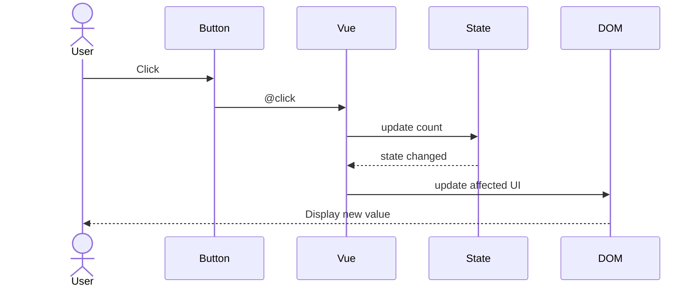

---

# 15. Event argument

Có thể lấy event:

```vue
<input @input="handleInput">
```

```javascript
function handleInput(event) {
  console.log(event.target.value);
}
```

Hoặc:

```vue
<button @click="handleClick('hello')">
  Click
</button>
```

```javascript
function handleClick(message) {
  console.log(message);
}
```

---

# 16. Conditional rendering

Vue cung cấp:

```vue
v-if
v-else-if
v-else
```

Ví dụ:

```vue
<div v-if="loading">
  Loading...
</div>

<div v-else-if="error">
  Something went wrong
</div>

<div v-else>
  Data loaded
</div>
```

Logic:

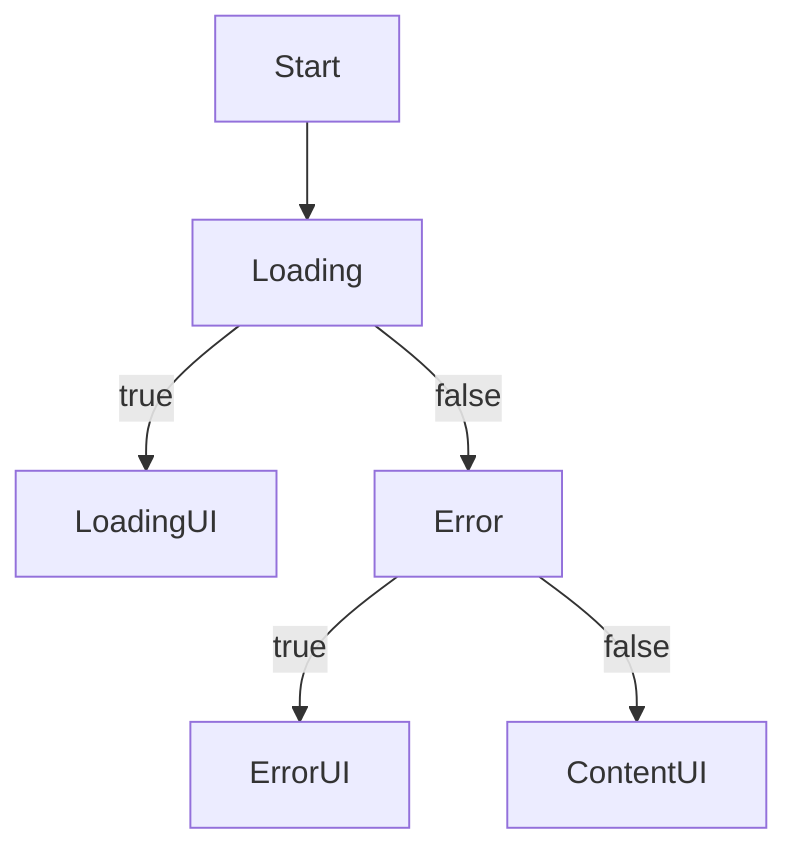

---

# 17. `v-show`

`v-show` khác `v-if`.

```vue
<div v-show="visible">
  Hello
</div>
```

Nó thường hoạt động bằng cách thay đổi CSS:

```css
display: none;
```

Trong khi `v-if` quyết định element có tồn tại trong DOM hay không.

### `v-if`

```text
condition = false
        ↓
element không được render
```

### `v-show`

```text
element vẫn tồn tại
        ↓
chỉ thay đổi visibility/display
```

Thông thường:

```text
v-if
→ nội dung ít khi thay đổi

v-show
→ toggle thường xuyên
```

---

# 18. List rendering — `v-for`

Ví dụ:

```javascript
const users = [
  { id: 1, name: 'John' },
  { id: 2, name: 'Alice' },
  { id: 3, name: 'Bob' }
];
```

Template:

```vue
<ul>
  <li
    v-for="user in users"
    :key="user.id"
  >
    {{ user.name }}
  </li>
</ul>
```

Kết quả:

```text
John
Alice
Bob
```

---

# 19. Tại sao cần `key`?

Khi dùng:

```vue
v-for="user in users"
```

nên có:

```vue
:key="user.id"
```

Ví dụ tốt:

```vue
<li
  v-for="user in users"
  :key="user.id"
>
```

Không nên:

```vue
:key="index"
```

nếu list có thể:

* insert
* delete
* reorder

`key` giúp Vue xác định identity của từng item.

```text
User #101
User #102
User #103
```

Nếu thứ tự thay đổi:

```text
#103
#101
#102
```

Vue vẫn biết:

```text
đây là #103
đây là #101
đây là #102
```

---

# 20. `ref`

`ref()` tạo một reactive value.

```javascript
import { ref } from 'vue';

const count = ref(0);
```

Trong JavaScript:

```javascript
count.value++;
```

Trong template:

```vue
{{ count }}
```

Template tự unwrap `.value`.

---

# 21. Tại sao phải `.value`?

Vì:

```javascript
ref(0)
```

không trả về trực tiếp:

```text
0
```

mà trả về một object reactive có concept tương tự:

```javascript
{
  value: 0
}
```

Do đó:

```javascript
count.value++;
```

Trong template Vue tự xử lý:

```vue
{{ count }}
```

thay vì:

```vue
{{ count.value }}
```

---

# 22. `reactive`

Ngoài `ref`, Vue có:

```javascript
reactive()
```

Ví dụ:

```javascript
const user = reactive({
  name: 'John',
  age: 30
});
```

Có thể sử dụng:

```javascript
user.name = 'Alice';
user.age++;
```

không cần `.value`.

---

# 23. `ref` vs `reactive`

Thông thường:

```javascript
const count = ref(0);
```

phù hợp primitive:

```text
string
number
boolean
```

Với object:

```javascript
const user = reactive({
  name: 'John'
});
```

Nhưng `ref` cũng hoàn toàn có thể chứa object:

```javascript
const user = ref({
  name: 'John'
});
```

Trong Vue 3, `ref` thường là lựa chọn rất linh hoạt.

Một convention phổ biến:

```javascript
const count = ref(0);
const user = ref(null);
const users = ref([]);
const loading = ref(false);
```

---

# 24. Computed

`computed()` dùng khi một giá trị được **tính toán từ state khác**.

Ví dụ:

```javascript
const price = ref(100);
const quantity = ref(2);

const total = computed(() => {
  return price.value * quantity.value;
});
```

Template:

```vue
<p>Total: {{ total }}</p>
```

---

# 25. Tại sao không dùng function?

Có thể viết:

```javascript
function getTotal() {
  return price.value * quantity.value;
}
```

Template:

```vue
{{ getTotal() }}
```

Nhưng `computed` có semantics tốt hơn cho **derived state** và có caching theo dependency.

```text
price ─────┐
           ├──► computed(total) ──► UI
quantity ──┘
```

`computed` nên được dùng cho:

> "Giá trị này có thể suy ra từ state hiện tại."

---

# 26. `watch`

`watch` dùng để **phản ứng với sự thay đổi của state để thực hiện side effect**.

Ví dụ:

```javascript
watch(search, (newValue, oldValue) => {
  console.log(newValue);
});
```

Một số use case:

```text
state thay đổi
    ↓
API call
localStorage
analytics
sync URL
trigger external library
```

Ví dụ:

```javascript
watch(search, async (value) => {
  await searchProducts(value);
});
```

---

# 27. `computed` vs `watch`

Đây là distinction rất quan trọng.

### `computed`

Dùng cho:

```text
State → Derived value
```

Ví dụ:

```javascript
const fullName = computed(() => {
  return `${firstName.value} ${lastName.value}`;
});
```

### `watch`

Dùng cho:

```text
State change → Side effect
```

Ví dụ:

```javascript
watch(userId, async (id) => {
  await loadUser(id);
});
```

Quy tắc đơn giản:

```text
Cần tính ra giá trị?
→ computed

Cần làm một hành động khi state đổi?
→ watch
```

---

# 28. `v-model`

`v-model` thường dùng cho form.

Ví dụ:

```vue
<input v-model="username">
```

Conceptually gần với:

```vue
<input
  :value="username"
  @input="username = $event.target.value"
/>
```

Luồng:

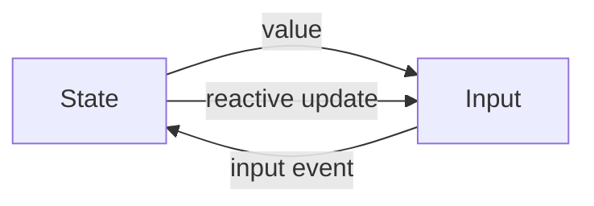

---

# 29. Component Communication

Component thường giao tiếp theo hướng:

```text
Parent
  │
  │ props
  ▼
Child
  │
  │ emit
  ▼
Parent
```

Ví dụ:

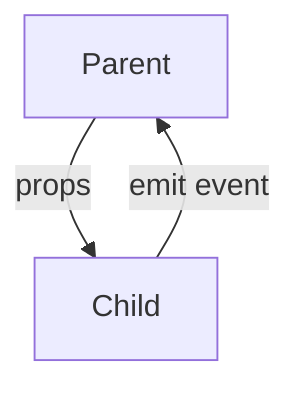

Đây là một trong những concept quan trọng nhất của Vue.

---

# 30. Props

Parent truyền dữ liệu xuống Child:

```vue
<ProductCard
  :product="product"
/>
```

Child:

```vue
<script setup>
defineProps({
  product: Object
});
</script>
```

Hoặc với TypeScript:

```vue
<script setup lang="ts">
interface Product {
  id: number;
  name: string;
  price: number;
}

const props = defineProps<{
  product: Product;
}>();
</script>
```

---

# 31. Props là readonly

Child không nên trực tiếp mutate props.

Không nên:

```javascript
props.product.name = 'New name';
```

Tư duy nên là:

```text
Parent sở hữu state
       ↓
Child nhận props
       ↓
Child hiển thị / sử dụng
```

Nếu Child muốn Parent thay đổi:

```text
Child
  ↓
emit event
  ↓
Parent
  ↓
update state
  ↓
props mới
  ↓
Child
```

---

# 32. Emits

Child:

```javascript
const emit = defineEmits(['delete']);
```

Khi click:

```javascript
emit('delete', product.id);
```

Parent:

```vue
<ProductCard
  :product="product"
  @delete="handleDelete"
/>
```

```javascript
function handleDelete(id) {
  products.value = products.value.filter(
    product => product.id !== id
  );
}
```

---

# 33. Props + Emits

Một component có thể được hiểu như một function:

```text
                Props
                  ↓
             ┌─────────┐
             │ Component│
             └────┬────┘
                  ↓
               Events
```

Ví dụ:

```text
Input
  ↓
value prop
  ↓
Component
  ↓
update event
```

Đây chính là nền tảng của component composition.

---

# 34. Slots

Slots cho phép Parent truyền **content/UI** vào Child.

Child:

```vue
<template>
  <div class="card">
    <slot />
  </div>
</template>
```

Parent:

```vue
<Card>
  <h2>Hello</h2>
  <p>This is content.</p>
</Card>
```

Concept:

```text
Parent
   │
   │ content
   ▼
┌─────────────┐
│     Card    │
│             │
│   <slot>    │
│             │
└─────────────┘
```

---

# 35. Named Slots

Child:

```vue
<slot name="header" />
<slot />
<slot name="footer" />
```

Parent:

```vue
<Card>
  <template #header>
    <h1>Title</h1>
  </template>

  <p>Content</p>

  <template #footer>
    <button>Save</button>
  </template>
</Card>
```

---

# 36. Lifecycle

Component có vòng đời.

Một cách hình dung:

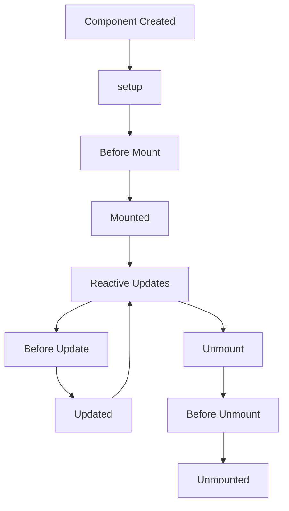

Các lifecycle hook phổ biến:

```javascript
onMounted()
onUpdated()
onUnmounted()
```

---

# 37. `onMounted`

Thường dùng khi component đã được mount.

Ví dụ load data:

```javascript
onMounted(async () => {
  await loadProducts();
});
```

Hoặc:

```javascript
onMounted(() => {
  console.log('Component mounted');
});
```

---

# 38. API call trong Vue

Ví dụ:

```javascript
const products = ref([]);
const loading = ref(false);
const error = ref(null);

async function loadProducts() {
  loading.value = true;
  error.value = null;

  try {
    const response = await fetch('/api/products');

    products.value = await response.json();
  } catch (e) {
    error.value = e;
  } finally {
    loading.value = false;
  }
}
```

Template:

```vue
<template>
  <div v-if="loading">
    Loading...
  </div>

  <div v-else-if="error">
    Failed to load
  </div>

  <ProductList
    v-else
    :products="products"
  />
</template>
```

---

# 39. State trong ứng dụng

Có nhiều loại state.

## Local state

Chỉ component cần:

```javascript
const isOpen = ref(false);
```

## Shared state

Nhiều component cần:

```text
User
Cart
Permission
Notification
```

Có thể dùng Pinia.

## Server state

Dữ liệu đến từ backend:

```text
Products
Orders
Users
Reports
```

Cần quan tâm:

```text
loading
error
cache
refetch
pagination
stale data
```

## URL state

Ví dụ:

```text
/products?page=2&search=phone
```

URL cũng là một dạng state của application.

---

# 40. Pinia

**Pinia** là state management library chính thức cho Vue ecosystem hiện đại.

Ví dụ:

```javascript
import { defineStore } from 'pinia';

export const useCounterStore = defineStore('counter', () => {
  const count = ref(0);

  function increment() {
    count.value++;
  }

  return {
    count,
    increment
  };
});
```

Component:

```javascript
const counter = useCounterStore();

counter.increment();
```

---

# 41. Khi nào cần Pinia?

Không phải state nào cũng cần đưa vào store.

Không nên:

```text
Mọi ref
   ↓
Pinia
```

Thay vào đó:

```text
Chỉ một component
→ local state

Một nhóm component
→ props / emits / composable

Nhiều phần application
→ Pinia/store
```

Ví dụ:

```text
isModalOpen
→ local

selectedProduct
→ có thể local / parent

currentUser
→ store

cart
→ store

authentication
→ store
```

---

# 42. Composable

Composable là function tái sử dụng logic reactive.

Ví dụ:

```javascript
// useCounter.js

import { ref } from 'vue';

export function useCounter() {
  const count = ref(0);

  function increment() {
    count.value++;
  }

  function decrement() {
    count.value--;
  }

  return {
    count,
    increment,
    decrement
  };
}
```

Component:

```vue
<script setup>
const {
  count,
  increment,
  decrement
} = useCounter();
</script>
```

---

# 43. Component vs Composable

Đây là distinction quan trọng.

### Component

Tái sử dụng:

```text
UI + logic
```

Ví dụ:

```text
ProductCard.vue
Modal.vue
UserTable.vue
```

### Composable

Tái sử dụng:

```text
logic
```

Ví dụ:

```text
useAuth()
useFetch()
usePagination()
useDebounce()
useLocalStorage()
```

---

# 44. Router

Ứng dụng SPA thường có nhiều URL:

```text
/
 /products
 /products/123
 /orders
 /profile
```

Vue Router quản lý việc mapping:

```text
URL
 ↓
Route
 ↓
Component
```

Ví dụ:

```javascript
const routes = [
  {
    path: '/',
    component: HomeView
  },
  {
    path: '/products',
    component: ProductListView
  },
  {
    path: '/products/:id',
    component: ProductDetailView
  }
];
```

---

# 45. Dynamic route

Route:

```text
/products/:id
```

URL:

```text
/products/123
```

Có thể lấy:

```javascript
const route = useRoute();

console.log(route.params.id);
```

Kết quả:

```text
123
```

---

# 46. Navigation

Template:

```vue
<RouterLink to="/products">
  Products
</RouterLink>
```

Programmatically:

```javascript
const router = useRouter();

router.push('/products');
```

Hoặc:

```javascript
router.push({
  name: 'product-detail',
  params: {
    id: 123
  }
});
```

---

# 47. Vue application architecture

Một Vue application thực tế thường có:

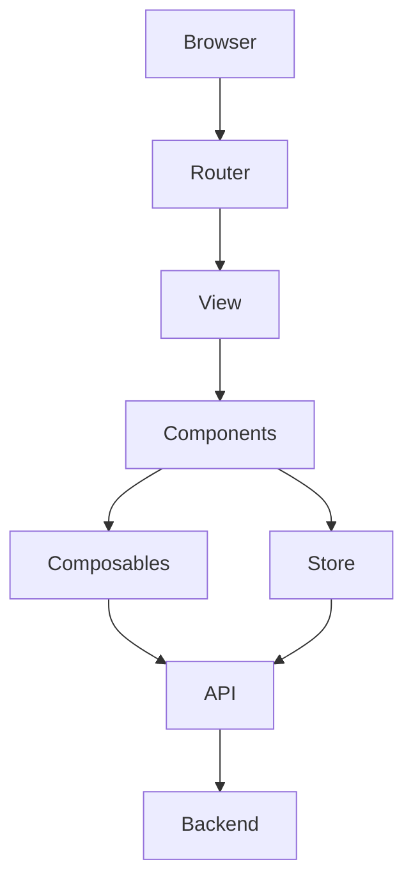

Ví dụ:

```text
Browser
   ↓
Vue Router
   ↓
ProductView
   ↓
ProductList
   ↓
ProductCard

ProductView
   ↓
useProducts()
   ↓
API Client
   ↓
Backend
```

---

# 48. Project structure

Một structure tương đối phổ biến:

```text
src/
├── assets/
├── components/
│   ├── common/
│   ├── product/
│   └── user/
│
├── composables/
│   ├── useAuth.ts
│   ├── useFetch.ts
│   └── usePagination.ts
│
├── layouts/
│   ├── DefaultLayout.vue
│   └── AuthLayout.vue
│
├── router/
│   └── index.ts
│
├── stores/
│   ├── auth.ts
│   └── cart.ts
│
├── services/
│   ├── api.ts
│   └── productApi.ts
│
├── types/
│   └── product.ts
│
├── views/
│   ├── HomeView.vue
│   ├── ProductListView.vue
│   └── ProductDetailView.vue
│
├── App.vue
└── main.ts
```

Đây không phải structure duy nhất.

Điều quan trọng là **separation of responsibility**.

---

# 49. `main.ts`

Entry point thường có dạng:

```typescript
import { createApp } from 'vue';
import { createPinia } from 'pinia';

import App from './App.vue';
import router from './router';

const app = createApp(App);

app.use(createPinia());
app.use(router);

app.mount('#app');
```

Luồng:

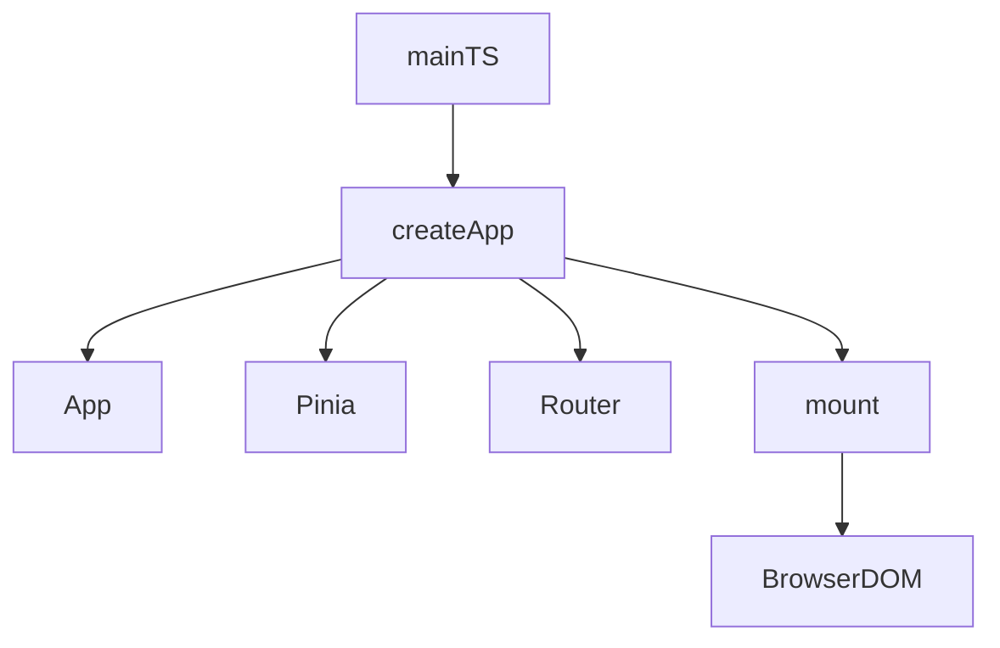

---

# 50. `App.vue`

`App.vue` thường là root component.

Ví dụ:

```vue
<template>
  <RouterView />
</template>
```

`RouterView` là nơi Vue Router render component tương ứng với URL hiện tại.

```text
/products
     ↓
Router
     ↓
ProductListView
     ↓
<RouterView />
```

---

# 51. Vue DOM update hoạt động thế nào?

Khi state thay đổi:

```javascript
count.value++;
```

không có nghĩa là Vue đơn giản chạy lại toàn bộ HTML.

Conceptually:

```text
State change
    ↓
Reactive dependency tracking
    ↓
Component update
    ↓
Virtual DOM / rendering pipeline
    ↓
Determine necessary DOM changes
    ↓
Update DOM
```

Có thể hình dung:

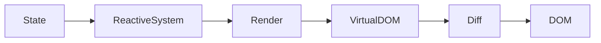

Không cần hiểu sâu Virtual DOM ngay khi mới học Vue.

Quan trọng trước tiên là hiểu:

> **State thay đổi → Vue biết UI nào phụ thuộc state đó → Vue cập nhật UI cần thiết.**

---

# 52. Dependency tracking

Ví dụ:

```javascript
const firstName = ref('John');
const lastName = ref('Doe');

const fullName = computed(() => {
  return `${firstName.value} ${lastName.value}`;
});
```

Khi computed chạy:

```text
computed(fullName)
        │
        ├── đọc firstName
        │
        └── đọc lastName
```

Vue có thể theo dõi dependencies.

Sau đó:

```javascript
firstName.value = 'Alice';
```

Vue biết:

```text
firstName changed
       ↓
fullName affected
       ↓
UI depending on fullName may update
```

---

# 53. Template directives

Các directive quan trọng:

| Directive | Ý nghĩa               |
| --------- | --------------------- |
| `v-if`    | conditional rendering |
| `v-else`  | nhánh else            |
| `v-for`   | render list           |
| `v-bind`  | bind attribute        |
| `v-on`    | event                 |
| `v-model` | two-way binding       |
| `v-show`  | toggle visibility     |
| `v-slot`  | slot                  |
| `v-html`  | render raw HTML       |

Shorthand:

```text
v-bind:src  → :src

v-on:click  → @click

v-slot      → #
```

---

# 54. `v-html` cần cẩn thận

Có thể:

```vue
<div v-html="html"></div>
```

Nhưng không nên đưa HTML chưa được sanitize từ user vào:

```javascript
const html = userInput;
```

vì có thể dẫn tới XSS.

Thông thường ưu tiên:

```vue
{{ text }}
```

thay vì:

```vue
v-html
```

---

# 55. Form

Ví dụ:

```vue
<script setup>
import { ref } from 'vue';

const username = ref('');
const password = ref('');

function submit() {
  console.log(username.value);
}
</script>

<template>
  <form @submit.prevent="submit">
    <input
      v-model="username"
      placeholder="Username"
    />

    <input
      v-model="password"
      type="password"
      placeholder="Password"
    />

    <button type="submit">
      Login
    </button>
  </form>
</template>
```

`.prevent` là event modifier:

```vue
@submit.prevent
```

tương tự ý tưởng:

```javascript
event.preventDefault();
```

---

# 56. Event modifiers

Một số modifier thường gặp:

```vue
@click.stop
@click.prevent
@click.once
@keyup.enter
```

Ví dụ:

```vue
<form @submit.prevent="submit">
```

```vue
<input @keyup.enter="search">
```

---

# 57. Async data flow

Một component thực tế thường có state:

```javascript
const data = ref(null);
const loading = ref(false);
const error = ref(null);
```

State machine có thể hình dung:

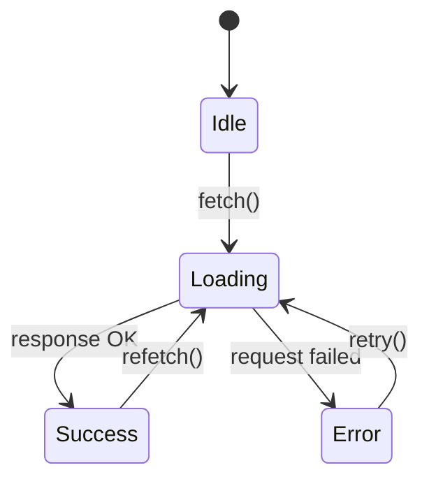

Đây là cách tư duy rất hữu ích khi xây dựng UI.

---

# 58. Một component API tốt

Ví dụ:

```vue
<UserTable
  :users="users"
  :loading="loading"
  @select="handleSelect"
  @delete="handleDelete"
/>
```

Component có API rõ ràng:

```text
Inputs:
    users
    loading

Outputs:
    select
    delete
```

Có thể coi component như một function:

```text
UserTable(
    users,
    loading
)
    ↓
UI
    ↓
select/delete events
```

---

# 59. Container vs Presentational Component

Một pattern hữu ích:

### Container

Chịu trách nhiệm:

```text
API
state
business logic
```

### Presentational

Chịu trách nhiệm:

```text
UI
props
emit
```

Ví dụ:

```text
ProductListView
    │
    ├── loadProducts()
    ├── loading
    └── products
            │
            ▼
       ProductTable
            │
            ├── props
            └── emits
```

Không bắt buộc phải áp dụng cứng nhắc, nhưng rất hữu ích khi application lớn.

---

# 60. Một ví dụ hoàn chỉnh

## `ProductList.vue`

```vue
<script setup lang="ts">
import { computed, onMounted, ref } from 'vue';

interface Product {
  id: number;
  name: string;
  price: number;
}

const products = ref<Product[]>([]);
const search = ref('');
const loading = ref(false);

const filteredProducts = computed(() => {
  const keyword = search.value.toLowerCase();

  return products.value.filter(product =>
    product.name.toLowerCase().includes(keyword)
  );
});

async function loadProducts() {
  loading.value = true;

  try {
    const response = await fetch('/api/products');

    products.value = await response.json();
  } finally {
    loading.value = false;
  }
}

onMounted(loadProducts);
</script>

<template>
  <section>
    <input
      v-model="search"
      placeholder="Search products"
    />

    <p v-if="loading">
      Loading...
    </p>

    <ul v-else>
      <li
        v-for="product in filteredProducts"
        :key="product.id"
      >
        {{ product.name }} -
        {{ product.price }}
      </li>
    </ul>
  </section>
</template>
```

Component này sử dụng nhiều concept:

```text
ref
computed
onMounted
v-model
v-if
v-for
:key
async/await
TypeScript
```

---

# 61. Phân tích ví dụ

```javascript
const products = ref([]);
```

→ state.

```javascript
const search = ref('');
```

→ state.

```javascript
const filteredProducts = computed(...)
```

→ derived state.

```javascript
onMounted(loadProducts);
```

→ lifecycle.

```vue
v-model="search"
```

→ form binding.

```vue
v-if="loading"
```

→ conditional rendering.

```vue
v-for="product in filteredProducts"
```

→ list rendering.

```vue
:key="product.id"
```

→ item identity.

---

# 62. Luồng của ví dụ

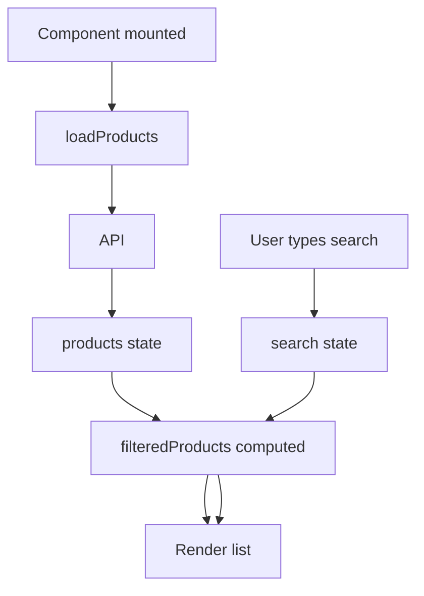

Điểm quan trọng:

> `filteredProducts` không phải state độc lập cần manually sync.

Nó được suy ra từ:

```text
products + search
```

---

# 63. Một lỗi thiết kế phổ biến

Không nên:

```javascript
const products = ref([]);
const search = ref('');
const filteredProducts = ref([]);

watch(
  [products, search],
  () => {
    filteredProducts.value = ...
  }
);
```

Nếu chỉ cần derived value, dùng:

```javascript
const filteredProducts = computed(() => {
  return ...
});
```

Đơn giản hơn và thể hiện đúng intent.

---

# 64. Một lỗi khác: nhồi quá nhiều logic vào component

Không nên có component:

```text
1000+ lines
```

chứa:

```text
API
validation
pagination
authentication
business logic
UI
modal
table
form
```

Có thể tách:

```text
Component
    ↓
Composable
    ↓
Service/API
```

Ví dụ:

```text
ProductView.vue
      │
      ├── useProducts()
      │
      └── ProductTable.vue
                │
                └── ProductRow.vue
```

---

# 65. Service/API layer

Thay vì:

```vue
<script setup>
fetch('/api/products');
fetch('/api/orders');
fetch('/api/users');
</script>
```

có thể tách:

```text
services/
├── productApi.ts
├── orderApi.ts
└── userApi.ts
```

Ví dụ:

```typescript
export async function getProducts() {
  const response = await fetch('/api/products');

  if (!response.ok) {
    throw new Error('Failed to load products');
  }

  return response.json();
}
```

Component:

```javascript
const products = await getProducts();
```

---

# 66. TypeScript với Vue

Nếu application lớn, TypeScript rất hữu ích.

Ví dụ:

```typescript
interface User {
  id: number;
  name: string;
  email: string;
}

const users = ref<User[]>([]);
```

Props:

```typescript
const props = defineProps<{
  user: User;
}>();
```

Emit:

```typescript
const emit = defineEmits<{
  select: [user: User];
  delete: [id: number];
}>();
```

Lợi ích:

```text
Compile-time safety
       ↓
IDE autocomplete
       ↓
Refactoring tốt hơn
       ↓
Ít runtime mistake hơn
```

---

# 67. Vue DevTools

Khi debug Vue application, nên sử dụng Vue DevTools.

Nó giúp inspect:

```text
Component tree
Props
State
Events
Pinia stores
Routes
```

Thay vì chỉ:

```javascript
console.log(...)
```

---

# 68. Những khái niệm cần học theo thứ tự

Không nên học tất cả cùng lúc.

Một roadmap tốt:

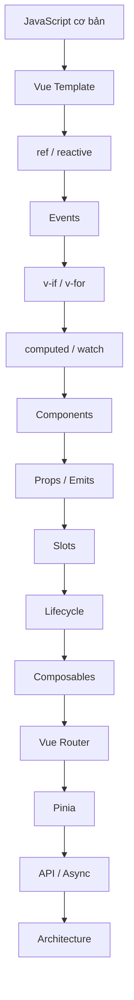

---

# 69. Những thứ JavaScript cần biết trước Vue

Nên chắc các concept:

```text
let / const
function
arrow function
object
array
destructuring
spread
map
filter
find
reduce
async / await
Promise
import / export
modules
DOM cơ bản
event
```

Đặc biệt:

```javascript
map()
filter()
find()
async/await
destructuring
```

được sử dụng rất nhiều trong Vue code.

---

# 70. Vue không thay thế JavaScript

Đây là điểm rất quan trọng.

Vue không phải một ngôn ngữ mới.

```text
JavaScript
     +
Vue APIs
     +
Vue template syntax
```

Bạn vẫn sử dụng:

```javascript
const
function
if
array.map()
array.filter()
Promise
async/await
try/catch
```

Vue chủ yếu cung cấp:

```text
Reactivity
Component system
Template system
Lifecycle
Ecosystem
```

---

# 71. Vue vs JavaScript thuần

### JavaScript thuần

Bạn thường thao tác trực tiếp với DOM:

```javascript
const button = document.querySelector('button');

button.addEventListener('click', () => {
  ...
});
```

### Vue

Bạn mô tả:

```vue
<button @click="increment">
  {{ count }}
</button>
```

Vue quản lý phần DOM update.

Có thể nói:

```text
Vanilla JS
→ Imperative DOM manipulation

Vue
→ Declarative UI
```

---

# 72. Imperative vs Declarative

## Imperative

Bạn nói:

> Làm thế nào?

Ví dụ:

```javascript
const element = document.querySelector('#counter');

element.textContent = count;
```

## Declarative

Bạn nói:

> UI phải như thế nào?

```vue
<div>
  {{ count }}
</div>
```

Vue lo phần:

```text
State → DOM
```

---

# 73. Vue application lớn

Khi application lớn, có thể hình dung architecture:

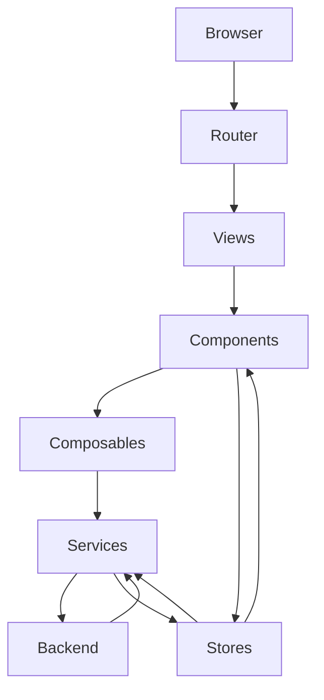

Một cách phân chia responsibility:

```text
Views
→ page composition

Components
→ reusable UI

Composables
→ reusable reactive logic

Stores
→ shared client state

Services
→ API/backend communication

Types
→ data contracts
```

---

# 74. Khi nào nên tạo component?

Tạo component khi:

### 1. Có khả năng reuse

```text
Button
Modal
Input
Table
Card
```

### 2. Có responsibility riêng

```text
UserTable
ProductFilter
OrderSummary
```

### 3. Component cha trở nên quá phức tạp

Ví dụ:

```text
ProductPage
├── ProductHeader
├── ProductGallery
├── ProductInfo
├── ProductReviews
└── ProductRelated
```

Không cần tách mọi `<div>` thành component.

---

# 75. Khi nào không nên tạo component?

Không nên biến:

```text
<div>
```

thành:

```text
DivWrapper.vue
```

chỉ để tránh một vài dòng code.

Component nên có **semantic responsibility**.

Tốt:

```text
ProductCard.vue
```

Không cần thiết:

```text
ProductCardContainerWrapperInner.vue
```

---

# 76. Một số nguyên tắc tốt

## 1. State càng gần nơi sử dụng càng tốt

```text
Local → Parent → Store
```

Không đưa tất cả vào global state.

---

## 2. Derived data dùng computed

```javascript
const total = computed(...)
```

---

## 3. Side effect dùng watch khi phù hợp

```javascript
watch(...)
```

---

## 4. Logic dùng nhiều nơi → composable

```javascript
usePagination()
useAuth()
useFetch()
```

---

## 5. API communication tách khỏi UI khi application đủ lớn

```text
Component
    ↓
Composable
    ↓
Service
    ↓
Backend
```

---

# 77. Những lỗi người mới thường gặp

### Quên `.value`

Trong JavaScript:

```javascript
count.value++;
```

không phải:

```javascript
count++;
```

nếu `count` là `ref`.

---

### Mutate props

Không nên:

```javascript
props.user.name = ...
```

Hãy để owner của state thay đổi nó.

---

### Dùng watch cho mọi thứ

Không phải mọi reactive operation đều cần `watch`.

Nếu chỉ tính toán:

```javascript
computed()
```

---

### Không dùng key

Không nên:

```vue
v-for="item in items"
```

nên:

```vue
v-for="item in items"
:key="item.id"
```

---

### Component quá lớn

Nếu một component làm quá nhiều việc:

```text
API
state
form
table
modal
validation
business logic
```

hãy xem xét tách.

---

# 78. Vue project thực tế

Một flow điển hình:

```text
User mở /products
       ↓
Vue Router
       ↓
ProductListView
       ↓
useProducts()
       ↓
productApi.getProducts()
       ↓
Backend
       ↓
products state
       ↓
computed filtering
       ↓
ProductTable
       ↓
ProductRow
```

Nếu user click Delete:

```text
User
 ↓
ProductRow
 ↓
emit('delete', id)
 ↓
ProductListView
 ↓
store/composable
 ↓
API DELETE
 ↓
update state
 ↓
Vue re-render
```

---

# 79. Vue cần nhớ những gì?

Nếu mới học, hãy tập trung vào 12 concept:

```text
1. Component
2. Template
3. ref
4. reactive
5. computed
6. watch
7. v-if
8. v-for
9. v-model
10. props
11. emits
12. lifecycle
```

Sau đó học:

```text
13. Composables
14. Router
15. Pinia
16. API integration
17. TypeScript
18. Architecture
```

---

# 80. Cheat sheet

## State

```javascript
const count = ref(0);
```

## Update state

```javascript
count.value++;
```

## Derived state

```javascript
const double = computed(() => count.value * 2);
```

## Watch state

```javascript
watch(count, value => {
  console.log(value);
});
```

## Event

```vue
<button @click="increment">
```

## Binding

```vue
<input :value="name">
```

## Two-way binding

```vue
<input v-model="name">
```

## Condition

```vue
<div v-if="loading">
```

## Loop

```vue
<div
  v-for="item in items"
  :key="item.id"
>
```

## Props

```javascript
const props = defineProps<{
  user: User;
}>();
```

## Emit

```javascript
const emit = defineEmits<{
  select: [id: number];
}>();
```

## Lifecycle

```javascript
onMounted(() => {
});
```

## Composable

```javascript
const { data, loading } = useSomething();
```

## Router

```javascript
router.push('/products');
```

## Store

```javascript
const store = useSomethingStore();
```

---

# 81. Mental model cuối cùng

Có thể gom toàn bộ Vue vào mô hình:

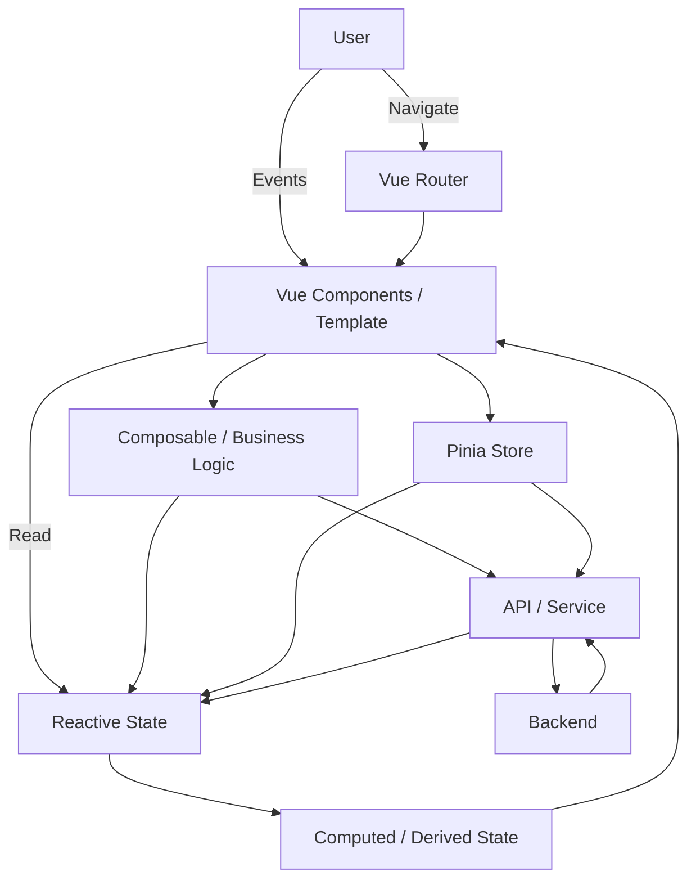

Cách tư duy quan trọng nhất:

```text
                 ┌──────────────┐
                 │    State     │
                 └──────┬───────┘
                        │
                        ▼
                 ┌──────────────┐
                 │      UI      │
                 └──────┬───────┘
                        │
                        │ User Event
                        ▼
                 ┌──────────────┐
                 │    Logic     │
                 └──────┬───────┘
                        │
                        ▼
                 ┌──────────────┐
                 │ Update State │
                 └──────┬───────┘
                        │
                        └──────────────► UI
```

Nếu hiểu được vòng lặp này:

> **State → UI → Event → Logic → State**

thì phần lớn các khái niệm Vue sau đó chỉ là cách tổ chức vòng lặp này cho application ngày càng lớn.

---

# 82. Lộ trình thực hành đề xuất

## Level 1 — Vue cơ bản

Làm:

```text
Counter
Todo List
Simple Form
```

Học:

```text
ref
v-model
v-if
v-for
@click
computed
```

---

## Level 2 — Component

Làm:

```text
Todo App
├── TodoList
├── TodoItem
├── TodoForm
└── TodoFilter
```

Học:

```text
props
emits
slots
component composition
```

---

## Level 3 — API

Làm:

```text
Product Management
```

Có:

```text
GET
POST
PUT
DELETE

loading
error
pagination
search
filter
```

---

## Level 4 — Application

Làm:

```text
Admin Dashboard
```

Có:

```text
Login
Router
Permission
Layout
Table
Form
Modal
Pagination
API
Pinia
```

---

## Level 5 — Production

Học:

```text
TypeScript
Composables
Testing
Error handling
Performance
Code splitting
Lazy loading
Authentication
Authorization
API architecture
State architecture
Component design
```

---

# 83. Kết luận

Vue không nên được học như một danh sách syntax.

Thay vào đó, hãy hiểu các tầng:

```text
                    Vue Application
                           │
             ┌─────────────┴─────────────┐
             │                           │
           UI Layer                  Logic Layer
             │                           │
        Components                  Composables
             │                           │
       Props / Emits                    │
             │                           │
          Template                 Business Logic
             │                           │
             └─────────────┬─────────────┘
                           │
                         State
                           │
                  ┌────────┴────────┐
                  │                 │
                Local             Global
                  │                 │
                 ref              Pinia
                  │                 │
                  └────────┬────────┘
                           │
                         API
                           │
                        Backend
```

Và nhớ 5 câu hỏi khi đọc hoặc viết Vue code:

### 1. State ở đâu?

```text
ref / reactive / Pinia
```

### 2. UI phụ thuộc state nào?

```text
template / computed
```

### 3. User tạo event gì?

```text
@click / @input / @submit
```

### 4. Logic xử lý ở đâu?

```text
component / composable / store
```

### 5. Data đi qua đâu?

```text
props
    ↓
component
    ↓
emit
    ↓
parent/store
    ↓
API
```

Hiểu được 5 câu hỏi này sẽ giúp bạn đọc một Vue codebase thực tế dễ hơn rất nhiều.
