Bạn có thể dạy theo kiểu **“evolutionary architecture”**: không bắt đầu bằng microservices/Kafka/Kubernetes, mà bắt đầu từ một ứng dụng rất đơn giản, sau đó mỗi phase xuất hiện một vấn đề thực tế → kiến trúc tiến hóa để giải quyết vấn đề đó.

Đây là cách dạy rất hợp với backend developer vì học viên hiểu được **“tại sao cần cái này”**, thay vì thuộc lòng pattern.

Tôi đề xuất dùng **một project xuyên suốt**, ví dụ `E-commerce / Order System`:

> Product → Cart → Order → Payment → Inventory → Notification

Mỗi phase scale hệ thống đó lên.

---

# Tổng roadmap

```mermaid
flowchart LR
    A["Phase 1<br/>MVC"] -->
    B["Phase 2<br/>SPA + REST"] -->
    C["Phase 3<br/>Modular Monolith"] -->
    D["Phase 4<br/>Production Backend"] -->
    E["Phase 5<br/>Scale Out"] -->
    F["Phase 6<br/>Cache"] -->
    G["Phase 7<br/>Async + Worker"] -->
    H["Phase 8<br/>Database Scaling"] -->
    I["Phase 9<br/>Distributed Systems"] -->
    J["Phase 10<br/>Microservices"] -->
    K["Phase 11<br/>Multi-region / Multisite"] -->
    L["Phase 12<br/>Architecture at Scale"]
```

Một nguyên tắc xuyên suốt khóa học:

```text
Requirement
    ↓
Simple architecture
    ↓
Bottleneck
    ↓
Measure
    ↓
Architecture change
    ↓
New trade-off
    ↓
New problem
```

Đừng dạy:

> Redis rất nhanh nên chúng ta dùng Redis.

Hãy dạy:

> Database bắt đầu chịu 20k read/sec. 90% request đọc cùng một tập dữ liệu. Chúng ta làm gì?

Từ đó mới dẫn tới cache.

---

# Phase 0 — Architecture Fundamentals

Trước MVC, nên có một phase rất ngắn để thống nhất vocabulary.

### Nội dung

* Software Architecture là gì?
* Architecture vs Design
* Component / Module / Service
* Dependency
* Coupling / Cohesion
* State / Stateless
* Sync / Async
* Latency / Throughput
* Availability
* Scalability
* Reliability
* Consistency
* CAP theorem chỉ giới thiệu, chưa đào sâu
* Vertical scaling vs Horizontal scaling

Đặc biệt nên dạy:

```text
Architecture = Trade-offs
```

Không có kiến trúc "best".

Chỉ có:

```text
best architecture
for a specific problem
under specific constraints
```

---

# Phase 1 — MVC: ứng dụng web truyền thống

Đây là điểm bắt đầu rất tốt.

Ví dụ:

```text
Spring Boot
Spring MVC
Thymeleaf
PostgreSQL
```

Kiến trúc:

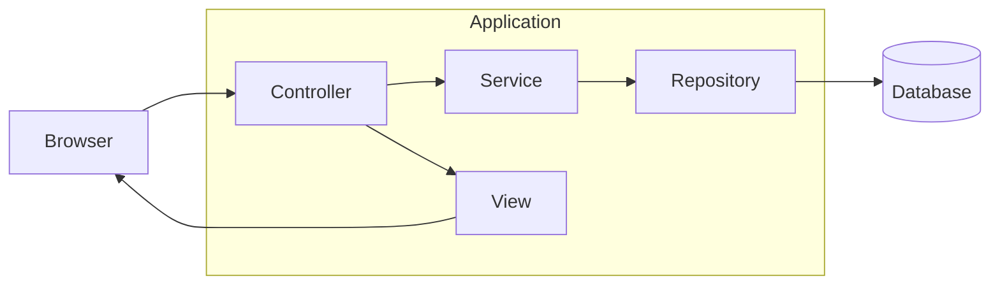

### Dạy

MVC:

```text
Model
View
Controller
```

Nhưng nên mở rộng ngay thành layered architecture:

```text
Controller
   ↓
Application / Service
   ↓
Domain
   ↓
Repository
   ↓
Database
```

Các concept:

* Controller không chứa business logic
* Service layer
* Repository pattern
* Transaction boundary
* Dependency inversion
* DTO vs Entity
* Validation
* Exception handling

### Bài tập

Xây:

```text
Product CRUD
Order CRUD
Customer CRUD
```

Đến đây hệ thống vẫn là:

```text
Browser
   ↓
Spring MVC
   ↓
PostgreSQL
```

---

# Phase 2 — SPA + REST API

Bây giờ đưa ra requirement:

> Frontend team muốn dùng React/Vue/Angular.

MVC server-rendering bắt đầu thay đổi.

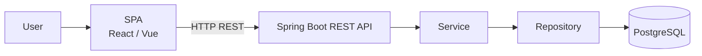

### Dạy

REST:

* Resource
* URI
* HTTP methods
* Status codes
* Stateless
* JSON
* DTO
* Pagination
* Filtering
* Sorting

Ví dụ:

```http
GET    /products
GET    /products/{id}
POST   /products
PUT    /products/{id}
DELETE /products/{id}
```

Sau đó:

* API versioning
* Validation
* Error response
* OpenAPI
* Swagger
* Authentication
* JWT / session

### Quan trọng

Giới thiệu:

```text
Frontend architecture
        vs
Backend architecture
```

Từ đây khóa học chuyển trọng tâm sang backend.

---

# Phase 3 — Monolith

Nhiều khóa học đi MVC → Microservices quá nhanh.

Tôi sẽ dành khá nhiều thời gian cho **Monolith**.

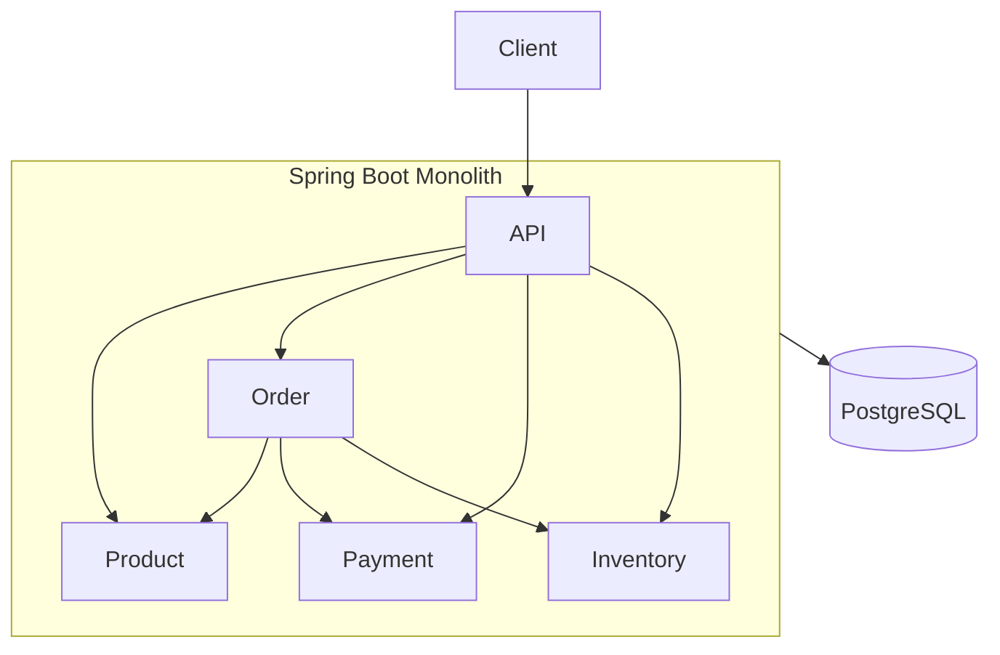

### Dạy

Monolith không phải anti-pattern.

Phân biệt:

```text
Big Ball of Mud
vs
Well-designed Monolith
vs
Modular Monolith
```

---

# Phase 4 — Modular Monolith

Bắt đầu chia domain.

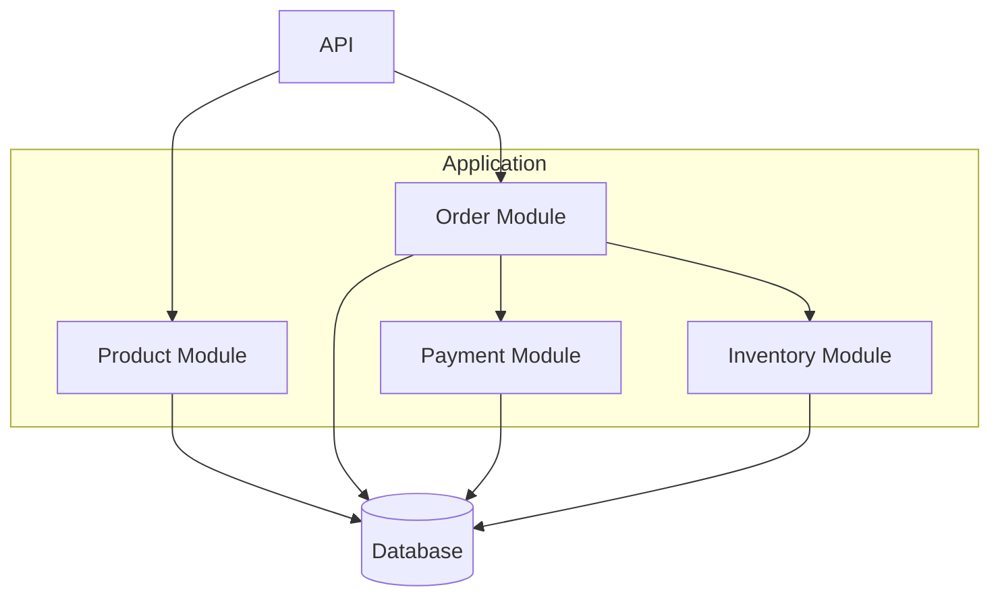

### Dạy

* Package by layer
* Package by feature
* Module boundary
* Public API của module
* Dependency rules
* Domain isolation

Có thể giới thiệu:

* DDD
* Aggregate
* Entity
* Value Object
* Domain Service
* Application Service

Nhưng **chưa cần full DDD**.

---

# Phase 5 — Production Backend

Bây giờ đặt câu hỏi:

> Code chạy được rồi. Nhưng production thì sao?

Thêm những thứ backend thực sự cần.

### API concerns

* Authentication
* Authorization
* RBAC
* Input validation
* Rate limiting
* Idempotency
* Pagination

### Reliability

* Timeout
* Retry
* Circuit breaker
* Bulkhead

### Observability

* Logging
* Metrics
* Tracing
* Correlation ID

### Security

* HTTPS
* CORS
* CSRF
* SQL Injection
* XSS
* Secrets

Architecture:

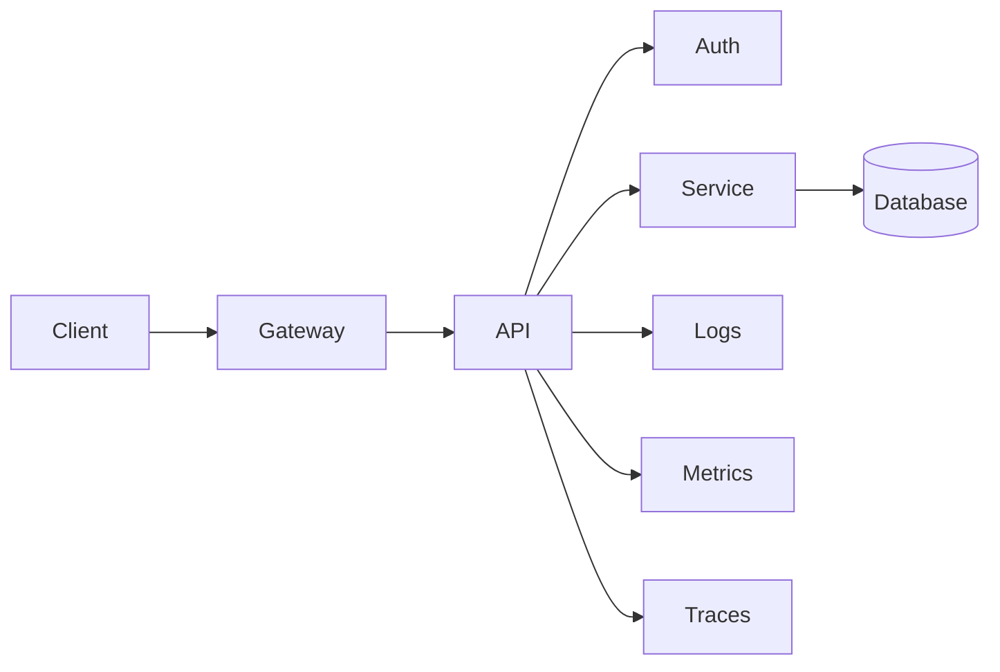

Java ecosystem:

```text
Spring Boot
Spring Security
Resilience4j
Micrometer
OpenTelemetry
Prometheus
Grafana
```

---

# Phase 6 — Scale Up → Scale Out

Đặt scenario:

```text
100 users
↓
10,000 users
↓
1,000,000 users
```

Server bắt đầu quá tải.

Ban đầu:

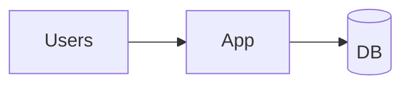

Scale vertically:

```text
2 CPU → 16 CPU
4 GB → 64 GB RAM
```

Sau đó gặp giới hạn.

Chuyển sang horizontal scaling.

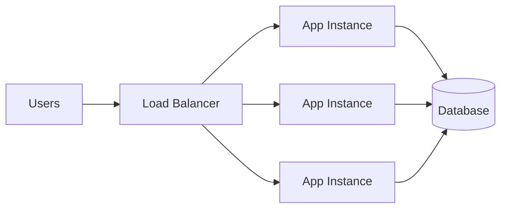

### Dạy

Load balancing algorithms:

* Round Robin
* Weighted Round Robin
* Least Connections
* Consistent Hashing

Concept quan trọng:

```text
Stateless application
```

Giải thích tại sao:

```text
HTTP session in memory
```

gây vấn đề khi có:

```text
App1
App2
App3
```

Từ đó dẫn sang:

* sticky session
* distributed session
* Redis session

---

# Phase 7 — Caching

Traffic tăng.

DB trở thành bottleneck.

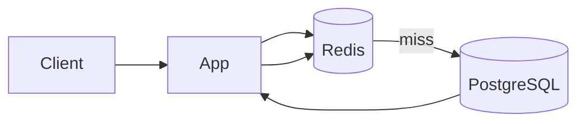

### Cache levels

Dạy từ gần user tới DB:

```text
Browser cache

CDN

Reverse proxy cache

Application cache

Distributed cache

Database cache
```

### Cache strategies

Phần này rất quan trọng.

#### Cache Aside

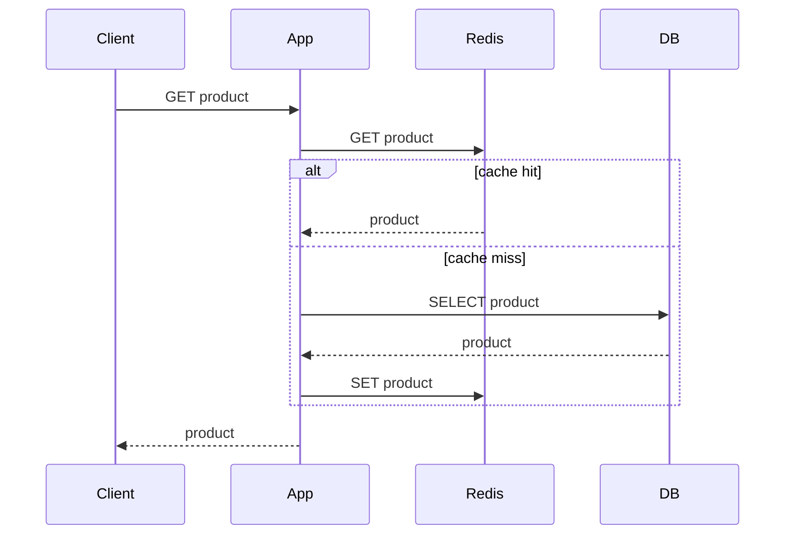

Sau đó:

* Read Through
* Write Through
* Write Behind
* TTL
* Eviction
* Cache invalidation
* Cache stampede
* Cache penetration
* Hot key

Đây là thời điểm rất tốt để hỏi:

> Nếu product price thay đổi trong DB nhưng Redis chưa đổi thì chuyện gì xảy ra?

Từ đó introduce:

```text
consistency
```

---

# Phase 8 — Async Processing & Worker

Đặt scenario:

User checkout.

Nếu synchronous:

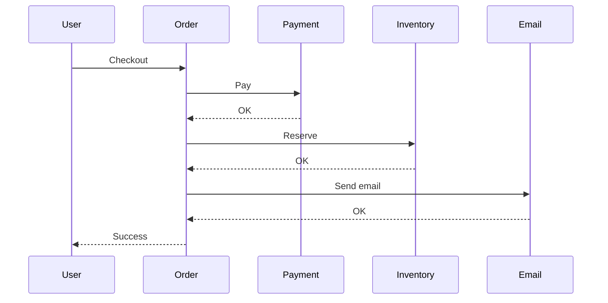

Latency:

```text
Payment    500ms
Inventory  200ms
Email      800ms

Total ~ 1500ms+
```

Không cần user chờ email.

Chuyển sang async.

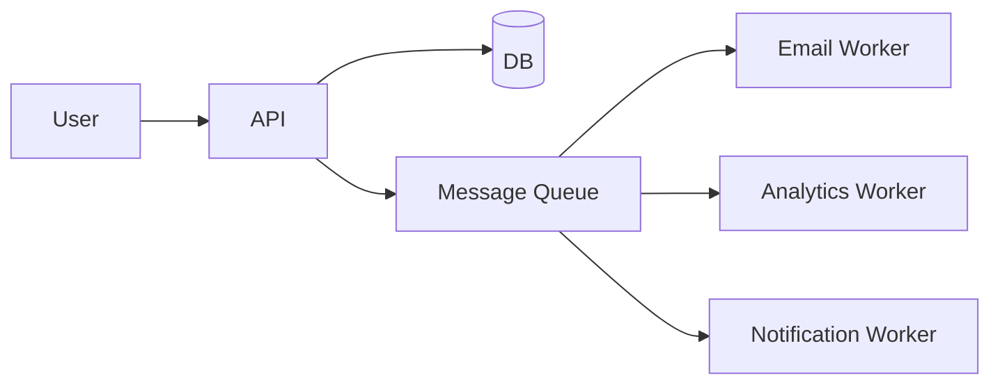

### Dạy

* Background jobs
* Worker
* Job queue
* Producer
* Consumer

Technology:

```text
RabbitMQ
Kafka
SQS
Redis Streams
```

---

# Phase 9 — Message Queue & Event Driven Architecture

Đào sâu async.

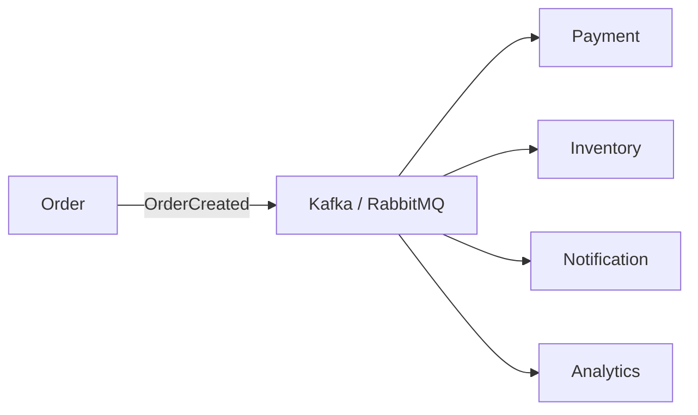

### Dạy

Messaging fundamentals:

* Queue
* Topic
* Producer
* Consumer
* Consumer group
* Offset
* Partition

Quan trọng nhất:

```text
At most once
At least once
Exactly once
```

Sau đó:

* duplicate messages
* idempotent consumer
* retry
* exponential backoff
* dead letter queue

Flow:

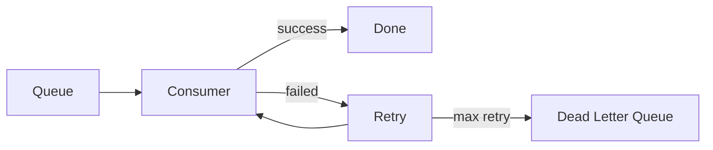

---

# Phase 10 — Database Scaling

Đây có thể là một module rất lớn.

Bắt đầu:

```text
Application
    ↓
Single PostgreSQL
```

---

## 10.1 Connection Pool

Trước khi scale DB, dạy:

```text
Connection Pool
```

Ví dụ Java:

```text
HikariCP
```

Concept:

```text
1000 HTTP requests
≠
1000 DB connections
```

---

# Phase 11 — Read Replica

Scenario:

```text
90% READ
10% WRITE
```

Tách read/write.

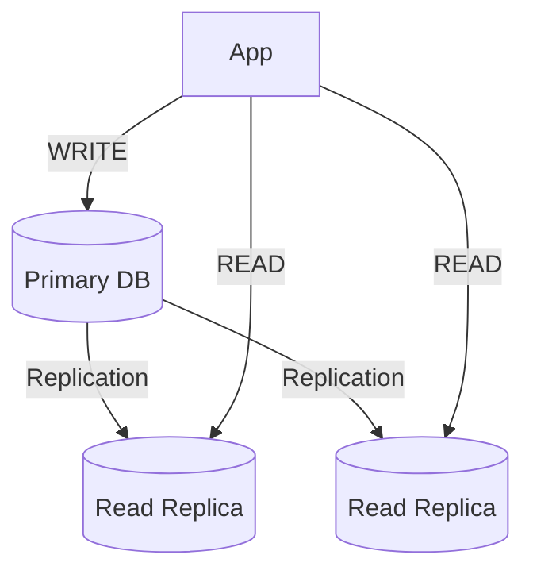

### Dạy

* Primary
* Replica
* Replication
* Replication lag
* Eventual consistency

Một case rất hay:

```text
POST /profile
↓
UPDATE primary

GET /profile
↓
read replica

old data
```

Từ đó học viên hiểu:

```text
Read-after-write consistency
```

---

# Phase 12 — Database Partitioning & Sharding

Bạn ghi `"shading"` — tôi đoán ý là **sharding**.

Khi một DB không đủ nữa:

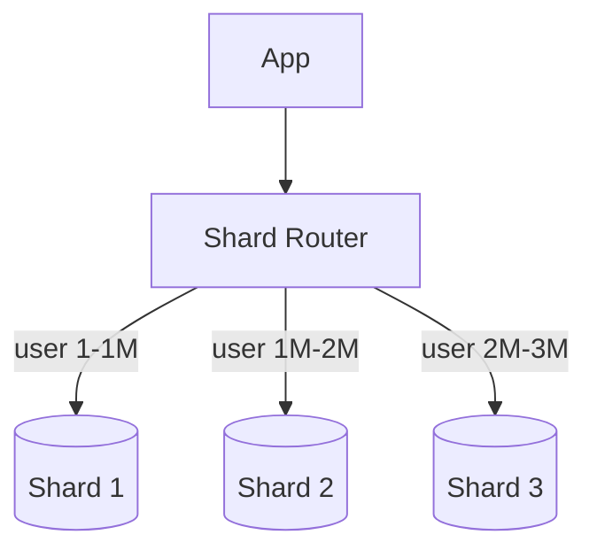

### Sharding strategies

#### Range

```text
user 1-1M       → shard 1
user 1M-2M      → shard 2
```

#### Hash

```text
hash(user_id) % shard_count
```

#### Directory based

```text
user_id → shard mapping
```

### Dạy problem khó

* Hot shard
* Rebalancing
* Resharding
* Cross-shard query
* Cross-shard transaction
* Global unique ID

Đây là nơi giới thiệu:

```text
Snowflake ID
UUID
ULID
```

---

# Phase 13 — CQRS

Khi read/write requirements rất khác nhau:

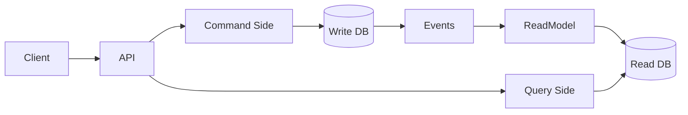

Dạy:

```text
Command
Query
Read Model
Write Model
```

Nhấn mạnh:

> CQRS không có nghĩa là bắt buộc phải có Kafka + Event Sourcing.

---

# Phase 14 — Distributed Transactions

Từ đây bắt đầu khó.

Order:

```text
Order
Payment
Inventory
```

Nếu chúng nằm ở 3 services:

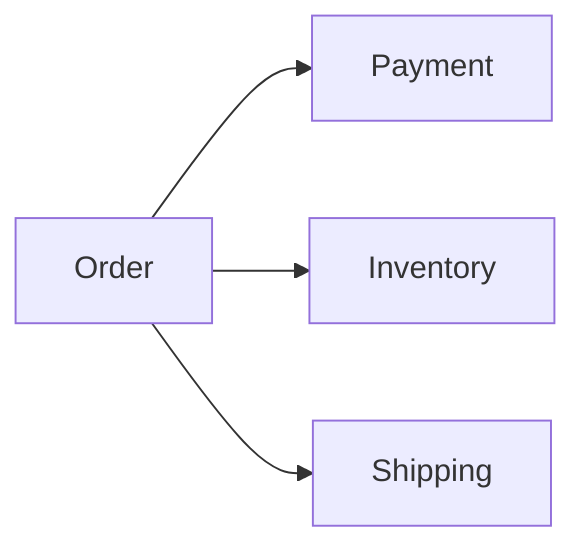

Problem:

```text
Payment success
Inventory failed
```

Làm sao rollback?

Không còn:

```java
@Transactional
```

giải quyết toàn bộ nữa.

---

# Phase 15 — Saga Pattern

### Orchestration

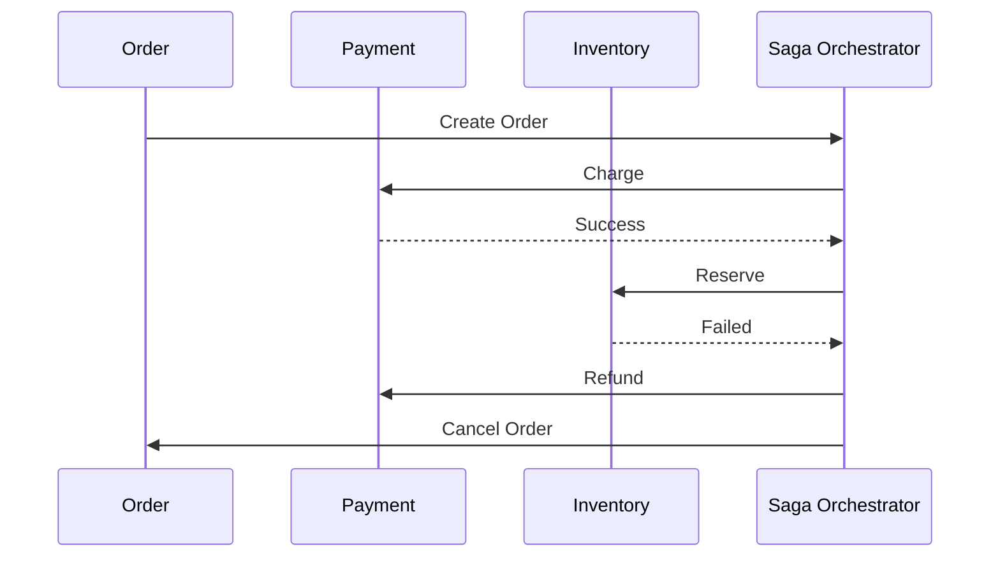

Dạy:

* Local transaction
* Compensation
* Saga
* Orchestration
* Choreography

---

# Phase 16 — Microservices

**Đến lúc này mới dạy Microservices.**

Học viên lúc đó đã hiểu tại sao cần tách.

Từ:

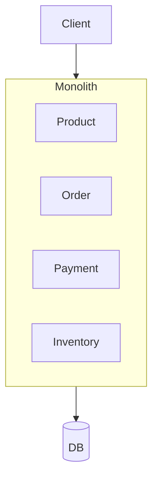

sang:

```mermaid
flowchart TB
    Client --> Gateway["API Gateway"]

    Gateway --> Product["Product Service"]
    Gateway --> Order["Order Service"]
    Gateway --> Payment["Payment Service"]

    Product --> ProductDB[(Product DB)]
    Order --> OrderDB[(Order DB)]
    Payment --> PaymentDB[(Payment DB)]

    Order --> Broker["Message Broker"]
    Broker --> Payment
```

### Dạy

* Service boundary
* Database per service
* API Gateway
* Service discovery
* Inter-service communication
* REST vs gRPC
* Sync vs async

Và quan trọng:

### Why NOT microservices

* Operational complexity
* Network failure
* Distributed transactions
* Observability
* Deployment
* Testing
* Data consistency

---

# Phase 17 — API Gateway / BFF

```mermaid
flowchart LR
    Web --> BFFWeb["Web BFF"]
    Mobile --> BFFMobile["Mobile BFF"]

    BFFWeb --> Product
    BFFWeb --> Order

    BFFMobile --> Product
    BFFMobile --> Order
```

Topics:

* Routing
* Authentication
* Rate limiting
* Aggregation
* BFF
* API composition

---

# Phase 18 — Service Discovery

Dynamic infrastructure:

```mermaid
flowchart LR
    ServiceA --> Registry["Service Registry"]

    ServiceB --> Registry
    ServiceC --> Registry

    Registry --> ServiceA
```

Concept:

```text
Client-side discovery
Server-side discovery
DNS discovery
```

Có thể liên hệ:

```text
Kubernetes Service / DNS
```

---

# Phase 19 — Deployment Architecture

Từ software architecture sang infrastructure architecture.

```mermaid
flowchart TB
    Internet --> CDN
    CDN --> LB["Load Balancer"]

    LB --> Node1
    LB --> Node2

    subgraph Node1
        App1
        App2
    end

    subgraph Node2
        App3
        App4
    end

    App1 --> Redis[(Redis)]
    App2 --> Redis
    App3 --> Redis
    App4 --> Redis

    App1 --> DB[(Database)]
    App2 --> DB
    App3 --> DB
    App4 --> DB
```

Topics:

* Container
* Docker
* Kubernetes
* Replica
* Pod
* Deployment
* Service
* Ingress
* Autoscaling
* Rolling deployment
* Blue/Green
* Canary

---

# Phase 20 — Multi-site / Multi-region

Bây giờ hệ thống global.

Ví dụ:

```text
Singapore
Frankfurt
Virginia
```

```mermaid
flowchart TB
    User --> DNS["Geo DNS"]

    DNS --> SG["Singapore Region"]
    DNS --> US["US Region"]

    subgraph SG
        LB1["Load Balancer"]
        AppSG["Application"]
        DBSG[(Database)]
        LB1 --> AppSG
        AppSG --> DBSG
    end

    subgraph US
        LB2["Load Balancer"]
        AppUS["Application"]
        DBUS[(Database)]
        LB2 --> AppUS
        AppUS --> DBUS
    end

    DBSG <-->|Replication| DBUS
```

### Dạy

* Active-passive
* Active-active
* Geo routing
* Latency routing
* Failover
* Disaster recovery

Các metric:

```text
RTO
RPO
```

---

# Phase 21 — Consistency & Distributed Systems

Đến đây mới nên đào sâu theory.

### CAP theorem

```text
Consistency
Availability
Partition tolerance
```

Sau đó:

* Strong consistency
* Eventual consistency
* Read-your-writes
* Monotonic reads

Distributed system problems:

* Network partition
* Clock skew
* Split brain
* Partial failure

Đây là lúc architecture bắt đầu trở thành **distributed systems** thật sự.

---

# Phase 22 — Distributed Lock

Ví dụ:

```text
Only one worker can process this job
```

Dạy:

```text
DB lock
Redis lock
Distributed lock
```

Problem:

```text
Worker A acquired lock
↓
Worker A paused 30 seconds
↓
lock expired
↓
Worker B acquired lock
↓
Worker A wakes up
```

Từ đó introduce:

```text
Fencing token
```

---

# Phase 23 — Event Sourcing

Không nên dạy sớm.

Traditional:

```text
Order
status = SHIPPED
```

Event sourcing:

```text
OrderCreated
PaymentCompleted
InventoryReserved
OrderShipped
```

```mermaid
flowchart LR
    Command --> Domain
    Domain --> Events

    Events --> EventStore[(Event Store)]

    EventStore --> Projection

    Projection --> ReadDB[(Read Model)]
```

Dạy:

* Event log
* Projection
* Replay
* Snapshot
* Event versioning

---

# Phase 24 — High Availability

Scenario:

```text
Database server chết thì sao?
```

Architecture:

```mermaid
flowchart TB
    App --> Proxy["DB Proxy"]

    Proxy --> Primary[(Primary)]

    Primary --> Replica1[(Replica)]
    Primary --> Replica2[(Replica)]

    Monitor --> Primary
    Monitor --> Replica1

    Replica1 -.->|Failover| Primary
```

Dạy:

* Health check
* Failover
* Leader election
* Quorum
* Replication

---

# Phase 25 — Performance Engineering

Đây là phần rất đáng dạy riêng.

### Metrics

```text
Latency
Throughput
CPU
Memory
IO
Network
DB connections
Queue depth
```

Đặc biệt:

```text
p50
p95
p99
p99.9
```

Đừng chỉ nhìn average latency.

Dạy:

* Load testing
* Stress testing
* Soak testing
* Benchmarking

Tools:

```text
k6
Gatling
JMeter
```

Với Java:

```text
JFR
JMC
async-profiler
```

---

# Phase 26 — Resilience Patterns

Một module rất quan trọng.

```mermaid
flowchart LR
    A["Service A"] --> Timeout
    Timeout --> Retry
    Retry --> CircuitBreaker["Circuit Breaker"]
    CircuitBreaker --> B["Service B"]
```

Topics:

* Timeout
* Retry
* Exponential backoff
* Jitter
* Circuit breaker
* Bulkhead
* Rate limiter
* Load shedding
* Graceful degradation

Một rule nên nhấn mạnh:

```text
Never retry blindly.
```

Retry có thể biến:

```text
small outage
```

thành:

```text
retry storm
```

---

# Phase 27 — Observability

Ba pillars:

```mermaid
flowchart LR
    App --> Logs
    App --> Metrics
    App --> Traces

    Logs --> Observability
    Metrics --> Observability
    Traces --> Observability
```

Dạy:

```text
Logs → What happened?
Metrics → Is something wrong?
Tracing → Where is it wrong?
```

Stack:

```text
OpenTelemetry

Prometheus
Grafana

ELK / Loki

Jaeger / Tempo
```

---

# Phase 28 — Security Architecture

Không nên coi security chỉ là Spring Security.

Dạy:

```text
Authentication
Authorization

OAuth2
OIDC
JWT

RBAC
ABAC
```

Architecture:

```mermaid
flowchart LR
    User --> Identity["Identity Provider"]

    Identity -->|Token| User

    User -->|JWT| Gateway

    Gateway --> ServiceA
    Gateway --> ServiceB
```

Sau đó:

* API security
* Secret management
* TLS
* mTLS
* Zero Trust

---

# Phase 29 — Data Architecture

Tách một phase riêng về storage.

So sánh:

| Problem      | Storage       |
| ------------ | ------------- |
| Transaction  | PostgreSQL    |
| Cache        | Redis         |
| Search       | Elasticsearch |
| Event stream | Kafka         |
| Document     | MongoDB       |
| Analytics    | ClickHouse    |
| Object       | S3            |

Điểm cần dạy:

> Không có database nào tối ưu cho mọi workload.

Từ đây dẫn tới:

```text
Polyglot persistence
```

---

# Phase 30 — Architecture Patterns

Sau khi học viên đã gặp đủ vấn đề mới tổng hợp pattern.

### Application

```text
Layered Architecture
Hexagonal Architecture
Clean Architecture
Onion Architecture
```

### System

```text
Monolith
Modular Monolith
Microservices
Event Driven
SOA
Serverless
```

### Data

```text
CQRS
Event Sourcing
Saga
Outbox
CDC
```

---

# Một phase cực kỳ quan trọng: Transactional Outbox

Tôi chắc chắn sẽ thêm phần này.

Problem:

```java
saveOrder();

kafka.send("OrderCreated");
```

Nếu:

```text
DB commit success
Kafka send failed
```

thì mất event.

Outbox:

```mermaid
flowchart LR
    App --> TX["DB Transaction"]

    TX --> Order[(Order Table)]
    TX --> Outbox[(Outbox Table)]

    Outbox --> CDC["CDC / Publisher"]

    CDC --> Kafka
```

Dạy:

```text
Dual write problem
Transactional Outbox
CDC
Debezium
```

Đây là kiến thức backend architecture rất giá trị.

---

# Architecture cuối khóa

Sau khoảng 25-30 modules, học viên có thể hiểu một architecture kiểu:

```mermaid
flowchart TB
    Users --> CDN
    CDN --> WAF
    WAF --> LB["Global Load Balancer"]

    LB --> Gateway["API Gateway"]

    Gateway --> Product
    Gateway --> Order
    Gateway --> User

    Product --> Redis[(Redis)]
    Product --> ProductDB[(Product DB)]

    Order --> OrderDB[(Order DB)]

    Order --> Kafka["Kafka"]

    Kafka --> Payment
    Kafka --> Inventory
    Kafka --> Notification
    Kafka --> Analytics

    Payment --> PaymentDB[(Payment DB)]
    Inventory --> InventoryDB[(Inventory DB)]

    ProductDB --> ProductReplica[(Read Replica)]

    OrderDB --> Outbox[(Outbox)]

    Outbox --> Kafka

    Product --> Observability
    Order --> Observability
    Payment --> Observability
```

Quan trọng là đến cuối khóa, học viên **không chỉ biết đọc diagram này** mà có thể giải thích:

```text
Tại sao có CDN?
Tại sao có WAF?
Tại sao có Load Balancer?
Tại sao stateless?
Tại sao Redis?
Tại sao Kafka?
Tại sao worker?
Tại sao read replica?
Tại sao DB per service?
Tại sao Outbox?
Tại sao async?
Tại sao không gọi REST synchronous?
```

---

# Tôi sẽ gom thành 8 level để dễ tổ chức khóa học

Nếu curriculum có quá nhiều phase nhỏ, bạn có thể tổ chức thành **8 level lớn**.

| Level | Chủ đề                      | Outcome                         |
| ----- | --------------------------- | ------------------------------- |
| **1** | MVC & Web Fundamentals      | Hiểu cấu trúc application       |
| **2** | SPA + REST + Backend        | Thiết kế API                    |
| **3** | Monolith & Modular Monolith | Thiết kế backend lớn            |
| **4** | Scaling Fundamentals        | LB, stateless, cache            |
| **5** | Async Architecture          | Worker, queue, Kafka            |
| **6** | Data Scaling                | Replica, partition, sharding    |
| **7** | Distributed Systems         | Saga, CQRS, consistency         |
| **8** | Large Scale Architecture    | Microservices, multi-region, HA |

Tôi sẽ chia số buổi đại khái như sau:

```text
LEVEL 1
MVC
├── MVC
├── Layered Architecture
├── Dependency
└── Database

LEVEL 2
SPA + REST
├── REST
├── API Design
├── Authentication
└── Backend fundamentals

LEVEL 3
Application Architecture
├── Monolith
├── Modular Monolith
├── DDD basics
├── Clean Architecture
└── Hexagonal Architecture

LEVEL 4
Scaling
├── Vertical scaling
├── Horizontal scaling
├── Stateless
├── Load Balancer
├── CDN
└── Cache

LEVEL 5
Async
├── Worker
├── Job Queue
├── RabbitMQ
├── Kafka
├── Event Driven
├── Retry
└── DLQ

LEVEL 6
Database
├── Index
├── Connection Pool
├── Read Replica
├── Partition
├── Sharding
├── NoSQL
└── Search Engine

LEVEL 7
Distributed Systems
├── CAP
├── Consistency
├── Distributed Transaction
├── Saga
├── Outbox
├── CQRS
├── Event Sourcing
└── Distributed Lock

LEVEL 8
Architecture at Scale
├── Microservices
├── API Gateway
├── Service Discovery
├── Kubernetes
├── Observability
├── High Availability
├── Multi-region
└── Disaster Recovery
```

---

# Cách tôi khuyên bạn dạy từng bài

Mỗi architecture concept dùng cùng một format 6 bước:

```text
1. Current architecture

2. Requirement mới

3. Architecture bị vấn đề gì?

4. Những solution có thể dùng

5. Chọn solution

6. Trade-offs mới xuất hiện
```

Ví dụ bài **Read Replica**:

```text
Current
────────

App
 ↓
DB


Problem
───────

100k req/sec
95% SELECT


Solution
────────

        ┌── Read Replica
App ────┤
        └── Primary


New Problem
───────────

Replication lag


Next lesson
───────────

Consistency
```

Như vậy các bài sẽ **tự nối với nhau**.

---

## Một chuỗi story rất mạnh cho toàn khóa

Bạn có thể mở khóa học với:

```text
10 users
```

Architecture:

```text
Browser
   ↓
Spring MVC
   ↓
PostgreSQL
```

Sau đó mỗi vài bài tăng traffic:

```text
10
↓
1,000
↓
10,000
↓
100,000
↓
1,000,000
↓
100,000,000 users
```

Architecture tiến hóa:

```mermaid
flowchart LR
    MVC["MVC<br/>1 server"]

    REST["SPA + REST"]

    MONO["Modular<br/>Monolith"]

    LB["Load Balancer<br/>N instances"]

    CACHE["Distributed<br/>Cache"]

    QUEUE["Queue<br/>Workers"]

    DB["Replica<br/>Sharding"]

    MS["Microservices"]

    GLOBAL["Multi-region"]

    MVC --> REST --> MONO --> LB --> CACHE --> QUEUE --> DB --> MS --> GLOBAL
```

Theo cách này, khóa học của bạn sẽ không trở thành **“catalog 100 architecture patterns”**, mà thành một câu chuyện:

> **Một hệ thống từ 10 users tiến hóa thành hệ thống phục vụ hàng trăm triệu users như thế nào, và mỗi quyết định kiến trúc phải trả giá gì.**

Với background Java, tôi cũng sẽ dùng xuyên suốt một stack khá nhất quán như **Spring Boot → PostgreSQL → Redis → RabbitMQ → Kafka → Docker/Kubernetes → OpenTelemetry**, để học viên tập trung vào architecture thay vì mỗi bài lại phải học một framework mới.


"select * from user where email = " + input
input=khanhhd@mail.com ->
"select * from user where email = khanhhd@mail.com"
input="abf or 1=1 and role =admin"
"select * from user where email = abf or 1=1 and role =admin"

sql("select * from user where email = 'abf or 1=1 and role =admin'", input)